 # 1. 机器学习历史

##  1.1统计学视角A Statistician's Perspective

当前的机器学习是一个交叉学科，既从统计学也从计算机科学里借鉴了大量知识；

统计学是从理解数据发展起来的； 数据分析起源于数学的一个分支，这个分支主要研究如何更好地理解数据的生成机制，

为解决这个问题，统计学使用概率模型来对现实世界建模；

例如，用二项分布来描述考试中回答问题正确的数量、用泊松分布描述道路上日常事故的分布，或用长尾分布描述单词在文本中出现的频率。

ml001.png


使用上述这些概率模型工具做出推理，是理解数据生成机制问题的一个重要突破。这些数学函数用于描述我们日常生活的各个方面，但实践证明这些概率模型都过度简化了现实世界的问题， 不能适用于复杂的现实世界，通常这些基于特定场景的概率模型都过于简化，不能很好的适应现实世界的需要，
ml002.png


## 1.2计算机科学视角A Computer Scientist's Perspective

20世纪50年代的计算机科学家们在开发决策系统时，认识到**应避免硬编码所有的决策规则**，应该让机器从原始数据中自己提取模式和知识，

这种让机器从原始数据中提取模式和知识的能力，称为**机器学习**

ml003png
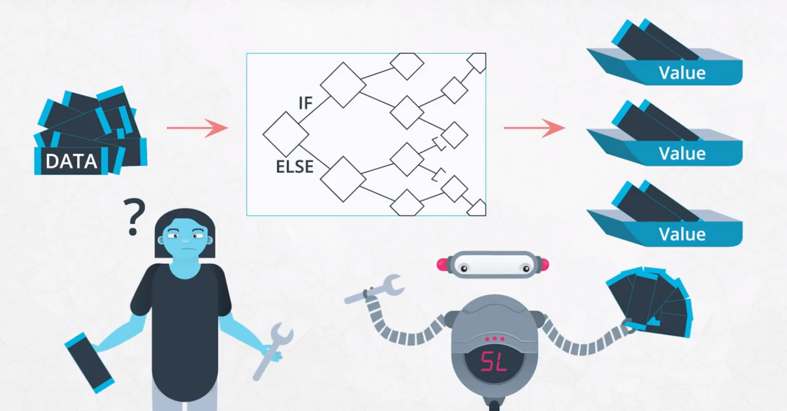

为了避免人工硬编码规则库，一些机器学习技术使用了统计学中的基于概率分布的理论，但这些过于简化的概率模型输出的数据，和现实世界中的数据之间，会有很大差异，

ml004.png
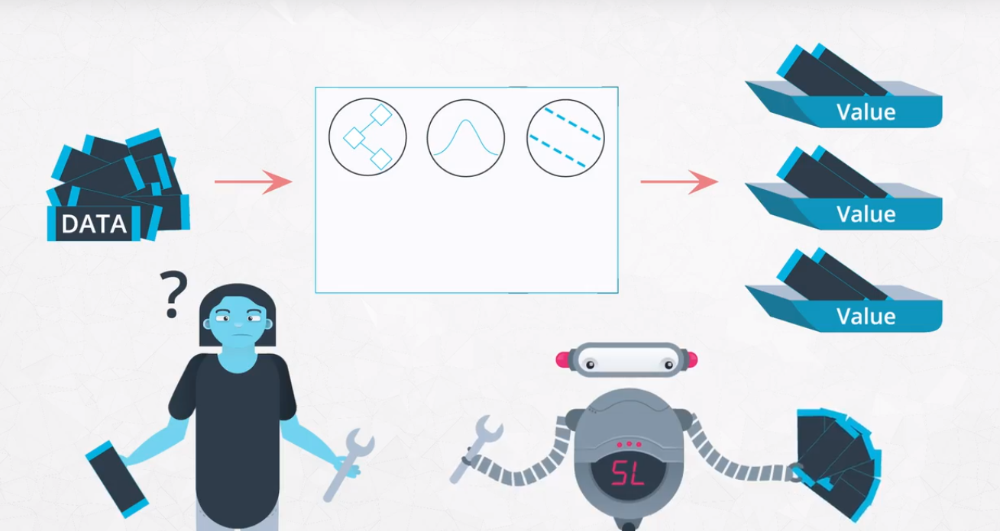

机器学习不断发展成为数据驱动的，高灵活度的模型，越来越少地依赖人工硬编码的规则库，这些数据驱动的模型，比过去的人工硬编码的规则库预测的更好，因此现在的机器学习系统经常使用各种灵活和复杂的数据驱动的模型，这些数据驱动的模型表现优于人工硬编码的规则库和简化的概率模型，

ml005.png
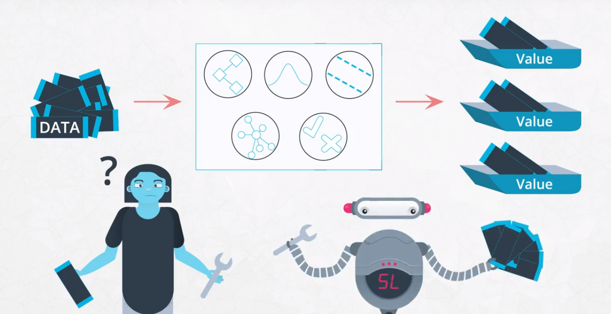

但不幸的是，这些数据驱动的模型有很强的黑箱性，虽然模型可能比医生更能识别肿瘤，或者在围棋游戏中战胜人类冠军，但是现在还不能完全理解模型是怎样作出决定。

ml006.png
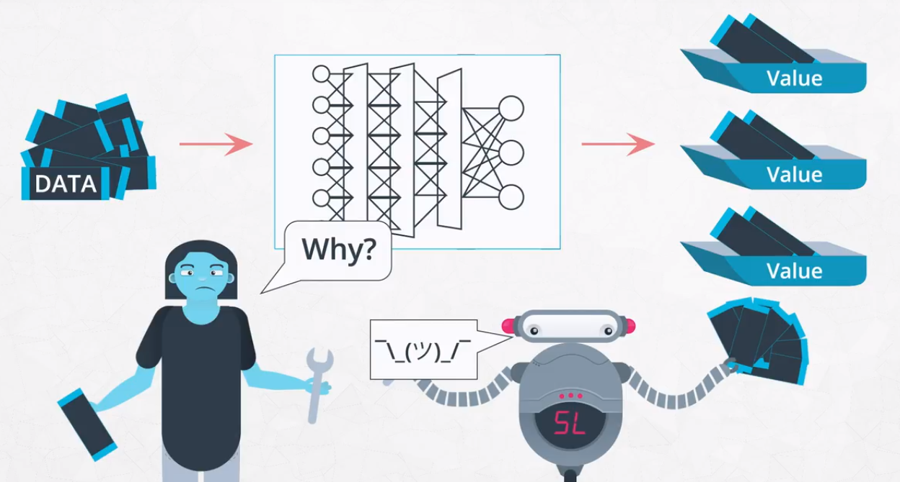

**计算机科学和统计学的结合，产生了在当前机器学习领域的各种技术**

# 2 机器学习的类型
机器学习发展出三大类型：

监督学习

非监督学习

强化学习

## 2.1 监督学习

通过学习人工标注的数据，模型可以根据从标注数据中观察到的模式(存储在模型中)，对任何新的未标注数据进行预测(分类或回归)。

ml008.png
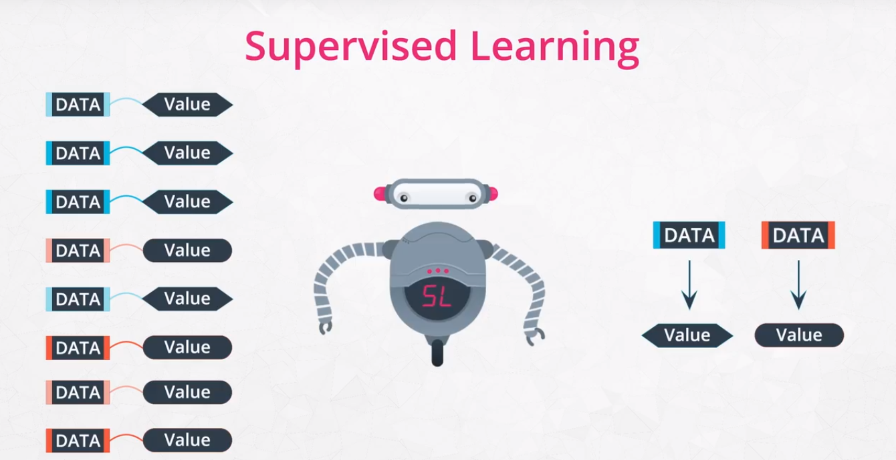

监督学习包括两大类：

ml009.png
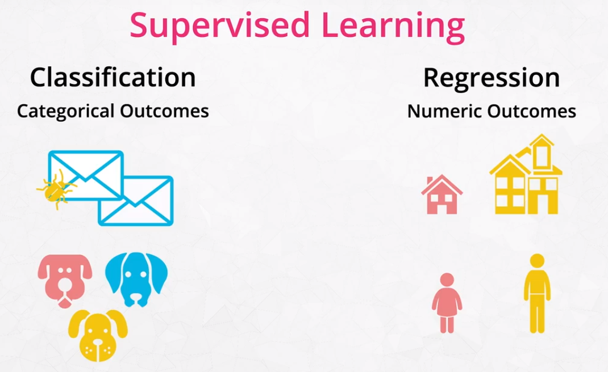

监督学习已经被广泛应用在,从垃圾邮件过滤到电影推荐等各种实际业务中。

## 2.2 非监督学习

通过学习没有人工标注的原始数据 ，自动学习创建模型，并对数据进行分类或分群。

ml010.png
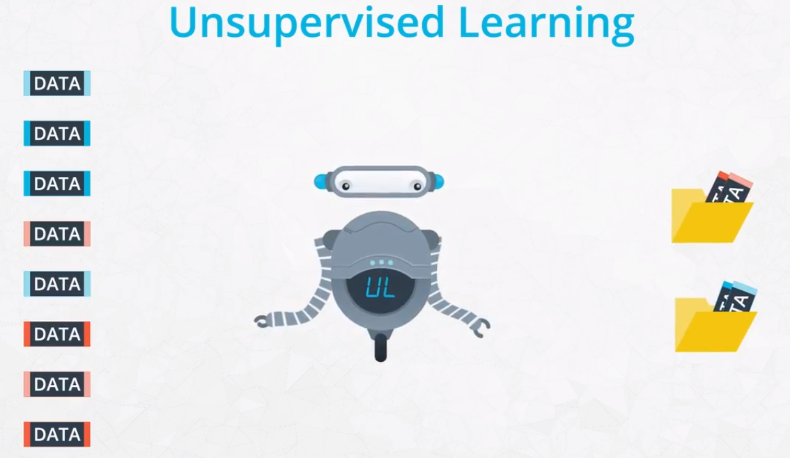

非监督学习被广泛应用在从商机发现和推荐系统的各种业务场景中。

深度学习也可以用在监督学习的图像识别任务中。

## 2.3 强化学习 Reinforcement Learning

强化学习，是让人工智体在与环境的交互过程中(奖励或惩罚)，通过学习策略，学会基于环境而行动，以取得最大化的预期利益。

ml011.png
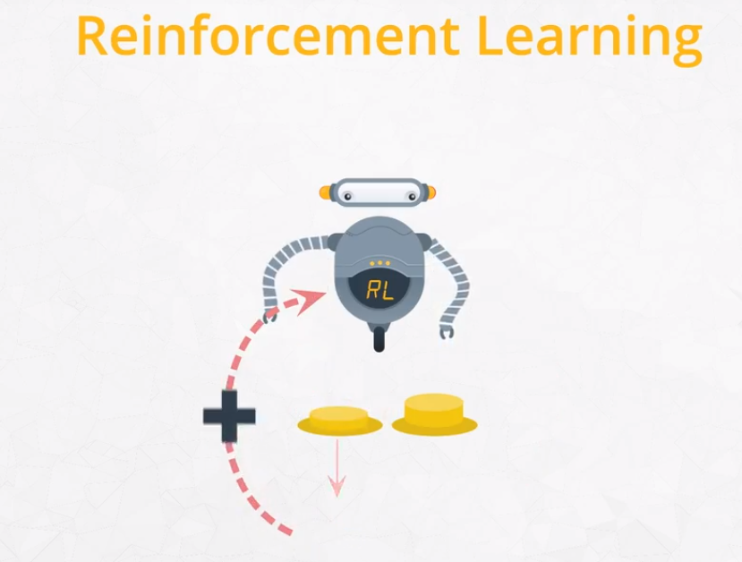

强化学习是最近机器学习领域里关注度很高的一个技术，但还有很多局限和问题要解决。训练强化学习的模型会有很多挑战，解决方法也比较复杂。

近年来，备受关注的强化学习话题是 AlphaGo 和 无人驾驶强化学习的另一个主要应用是AI 游戏的代理 Open AI Gym。

https://deepmind.com/blog/article/alphago-zero-starting-scratch

http://cs231n.stanford.edu/reports/2016/pdfs/112_Report.pdf


ml012.png
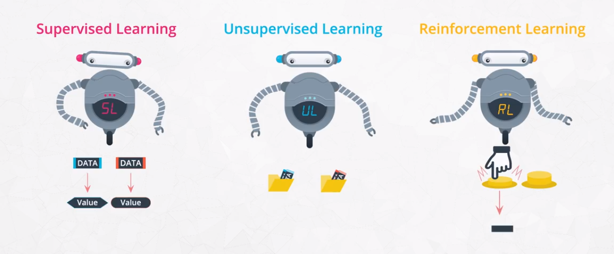

监督学习和非监督学习是本课程的两个重点技术,强化学习在数据科学的实际应用中用的不多。


# 3 深度学习

深度学习的预测能力，已经超过了其他的机器学习算法，并且深度学习也可以用在监督学习，非监督学习和强化学习上。

ml013.png
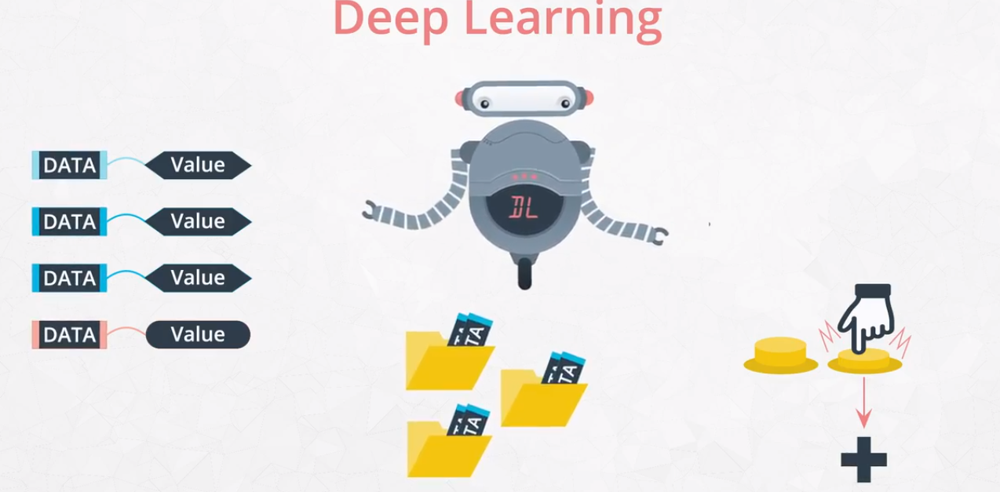

从历史的角度看，深度学习技术的兴起有其必然性，过去我们过于关注机器决策的过程和细节，现在我们更关心决策的准确性，这与深度学习的发展历程有密切联系，我们还不能完全理解深度学习的模型时怎样作出决策的，不幸的是深度学习不能解决所有问题，它存在三大局限：大量的数据，强大的计算力，黑箱性。

ml014.png
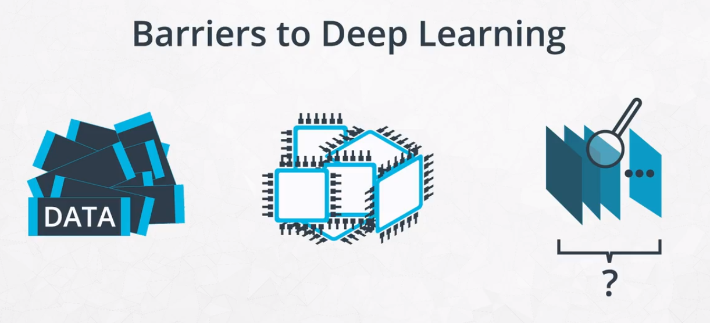

因此并不是所有的机器学习应用都需要使用深度学习，


# 4 Scikit  Learn

如果你对机器学习中的监督学习和非监督学习问题感兴趣，解决此类问题的一个最流行的开源机器学习库就是scikit-learn。

它为数据科学家们解决监督学习和非监督学习的相关问题，提供了先进的技术和便捷的工具，并适用于多种场景，未来scikit-learn将会继续是工业和学术界机器学习的主流技术。


# 5 机器学习中的伦理问题Ethics in ML

机器学习模型具有高效和智能地概括数据的能力，由于人类产生的数据常常存在错误和偏差，这些错误和偏差也会被带入到机器学习的模型中，

人类的偏差，也会迁移到计算机。

ml016.png


现在的计算机要摄取大量的图像、文本、语音和视频等数据，再由数据驱动的模型去作决策。
你应该牢记数据由人类产生，因此会有很多潜在的偏差，因此在真实环境下**检验模型**比统计检验更重要。


```python

```


```python

```
