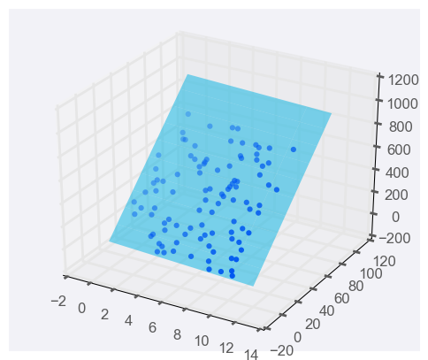

# 多项式回归

如果只有一个预测器变量，线条的方程是

y=mx+b

图形可能如下所示：


添加一个预测器变量，变成两个预测器变量后，预测方程是

$$
y = m_1 x_1 + m_2 x_2 + b
$$


要用图形表示，我们需要三维图形，并将线性回归模型表示成一个平面：



你可以使用两个以上的预测器变量，实际上可以使用任意多个，只要有用即可！如果你使用 n 个预测器变量，那么模型可以用以下方程表示：

$$
y = m_{1} x_{1} + m_{2} x_{2} + m_{3} x_{3}+ ...+m_{n} x_{n} + b
$$

如果模型有多个预测器变量，则很难用图形呈现，但幸运的是，关于线性回归的所有其他方面都保持不变。我们依然可以通过相同的方式拟合模型并作出预测，


```python
from sklearn.linear_model import LinearRegression
from sklearn.datasets import load_boston

# Load the data from the boston house-prices dataset 
boston_data = load_boston()
x = boston_data['data']
y = boston_data['target']

# Make and fit the linear regression model
# TODO: Fit the model and assign it to the model variable
model = LinearRegression()
model.fit(x,y)

# Make a prediction using the model
sample_house = [[2.29690000e-01, 0.00000000e+00, 1.05900000e+01, 0.00000000e+00, 4.89000000e-01,
                6.32600000e+00, 5.25000000e+01, 4.35490000e+00, 4.00000000e+00, 2.77000000e+02,
                1.86000000e+01, 3.94870000e+02, 1.09700000e+01]]
# TODO: Predict housing price for the sample_house
prediction = model.predict(sample_house)
```


```python
print(prediction)
```

    [23.68284712]


# 解数学方程组

根据均方误差得到的数学式，要求误差函数最小值，只需要对每个未知参数求导，在误差最小处，所有偏导数为0,这样得到n个位置参数的n个方差组，解出方程组，即可得到拟合最佳参数。

求n个方程组，需转置nxn矩阵，当n的个数非常大时，这个计算非常费时，这就是我们使用梯度下降法的原因，这种方法不能给出准确答案，但是可以无限接近最佳答案。


上诉过程，用矩阵来计算，可以得到以下式：
$$
W =(X^TX)^{-1}X^Ty
$$

正如上面说的，这种方法在现实生活中将会很昂贵而不实用，因为要找到矩阵的倒数 $X^TX$很难，如果是在 nxn 很大的情况下。 这就是我们需要经历多次梯度下降的痛苦的原因。

但是，如果我们的**数据稀疏**，即如果矩阵的大部分条目 X 是 0，就会有一些非常有趣的算法，能够迅速找到这个倒数，将使这种方法在现实生活中非常有用。

# 线性回归注意事项

1.线性回归会根据训练数据生成直线模型。如果训练数据包含**非线性关系**，你需要选择：调整数据（进行数据转换）、增加特征数量（参考下节内容）或改用其他模型。

2.容易受到异常值影响
线性回归的目标是求取对训练数据而言的 “最优拟合” 直线。如果数据集中存在不符合总体规律的异常值，最终结果将会存在不小偏差。

在大多数情况下，模型需要基本上能与大部分数据拟合，所以要小心异常值！

# 多项式回归

当出现以下数据，无法用直线拟合时，可以选择用多项式拟合，比如设置参数为$w_1,w_2,w_3,w_4$；

我们只需要求出平均绝对误差或者均方误差，对4个变量求导，使用梯度下降法，修改4个权重，最小化误差。这种方法称为，多项式回归。


多项式拟合，执行以下步骤：

1. 加载数据
数据保存在 'data.csv' 文件中。注意数据文件有一个标题行。
确保已将数据拆分为预测器变量 X 和结果变量 y。
确保 X是一个20行1列的二维数组。你可能需要 NumPy的 reshape 函数完成这个数据转换工作。

2. 创建多项式特征

生成一个sklearn 的 PolynomialFeatures 类的实例并把它赋值给变量 poly_feat。请注意怎样设置多项式的次 (degree)，这是本练习的关键。

用PolynomialFeatures 对象的 .fit_transform() 方法生成多项式的特征。这个方法的"fit"部分用于设置扩展后的预测器变量数，而"transform"部分负责根据设置执行具体扩展。把新特征矩阵赋值给变量X_poly.

3. 创建多项式回归模型

通过组合sklearn的[LinearRegression]类和多项式特征创建多项式回归模型。把拟合好的模型赋值给poly_model。


```python

# TODO: Add import statements
import numpy as np
import pandas as pd
from sklearn.linear_model import LinearRegression
from sklearn.preprocessing import PolynomialFeatures

# Assign the data to predictor and outcome variables
# TODO: Load the data
train_data = pd.read_csv('data_polynomial.csv')
X = train_data['Var_X'].values.reshape(-1, 1)
y = train_data['Var_Y'].values

# Create polynomial features
# TODO: Create a PolynomialFeatures object, then fit and transform the
# predictor feature
#设定模型最高次数
poly_feat = PolynomialFeatures(degree = 4)
X_poly = poly_feat.fit_transform(X)

# Make and fit the polynomial regression model
# TODO: Create a LinearRegression object and fit it to the polynomial predictor
# features
poly_model = LinearRegression(fit_intercept = False).fit(X_poly, y)

# Once you've completed all of the steps, select Test Run to see your model
# predictions against the data, or select Submit Answer to check if the degree
# of the polynomial features is the same as ours!
```

# 正则化

左边模型简单，有小许错误，右边模型复杂，没有错误，而实际上左边简单模型泛化的更好，右边明显过拟合。

问题是在训练时，右边复杂模型更容易出现，因为过拟合时，误差更小，那我们如何得到左侧的模型呢？


如图见，多元方程式更加复杂，包括高次项，而左边线性模型，更加简单，系数更少；

如果我们能够通过这些参数的某个函数来表达这种误差，那将非常有用，因为在某种程度上，模型的复杂性将体现在这个函数中，一个复杂模型相较于简单模型将得到更大的误差。

简单说，就是拿这些系数，加到误差里:

## L1 Regularization

L1正则化：把所有系数的绝对值加起来，加到误差里。


如图见，这样复杂的模型，就得到较大的误差。这就是L1正则化，它与绝对值有关。

## L2 Regularization

L2正则化，是把所有系数的平方加起来，加到误差里。


我们再次看到复杂模型比简单模型受到更多“惩罚”。

## $\lambda$ 参数

现有个新问题，如果我们的惩罚复杂模型太少或太多怎么办？有些模型，比如火箭发射，医学模型，几乎没有容错的余地，那么我们接受一定的复杂性；

而其他一些模型，比如视频推荐，社交网络潜在好友推荐等有更大的容错空间，需要模型简单从而更快地处理海量数据，因此可以接受一定误差。


似乎对于每一个案例，我们必须调整要在多大程度上“惩罚”每个模型的复杂度，这个问题可以通过参数$\lambda$来解决。

用$\lambda$来调整对复杂模型的“惩罚”力度：


总而言之，如果我们的$\lambda$值很大，那么将对模型复杂度有很大程度的惩罚，我们选择更简单的模型；

反之，$\lambda$越小，对模型惩罚小，选择更复杂的模型。


## L1 or L2的对比

L1更简单，但是L2更容易求导，所以只有数据很稀疏时，L1才可能比L2快。

L1有个好处，可以选择特征，将无用噪声列设置为零。


## 正则化练习

sklearn中有一些类帮助将线性回归正则化。你将练习怎样实现将线性回归正则化。

在附件的数据文件 (data.csv)中，你将看到一组数据点，包括6个预测器变量和1个结果变量。

使用sklearn 的 Lasso 类，根据这些数据拟合一个线性回归模型，同时还使用L1正则化来控制模型的复杂性。


```python
# TODO: Add import statements
import numpy as np
import pandas as pd
from sklearn.linear_model import Lasso

# Assign the data to predictor and outcome variables
# TODO: Load the data
train_data = pd.read_csv('lambda.csv', header = None)
X = train_data.iloc[:,:-1]
y = train_data.iloc[:,-1]

# TODO: Create the linear regression model with lasso regularization.
lasso_reg = Lasso()


# TODO: Fit the model.
lasso_reg.fit(X, y)

# TODO: Retrieve and print out the coefficients from the regression model.
reg_coef = lasso_reg.coef_
print(reg_coef)
```

    [ 0.          2.35793224  2.00441646 -0.05511954 -3.92808318  0.        ]


# 特征缩放

什么是特征缩放？特征缩放是把数据 (各个特征) 变换到同一个尺度。两种常见的缩放方法：

1.标准化

2.归一化

## 1.标准化
标准化是对列中的每个值减去均值后再除以方差，即数据被转换为均值为0，标准差为1。

在Python中，假设在 df 中有一列叫 height。可以用以下语句，创建一个标准化的高度：

$$
df["height_{standard}"] = \frac{(df["height"] - df["height"].mean())}{df["height"].std()}
$$

这将创建一个新的 "标准化" 列 。新列中的每一项都是原列值减去列均值后再除以列方差，新的标准化值可以解释为，原高度与平均高度之间相差多少个标准差。这是最常见的一种特征缩放技术。

## 2.归一化

第二种特征缩放方法是著名的归一化。归一化将数据压缩到0和1之间。仍使用上面标准化的例子，可以用下面的 Python 语句归一化数据：

$$
df["height_normal"] = \frac{(df["height"] - df["height"].min())}{(df["height"].max() - df['height'].min())}
                      $$
                      

## 什么时候做特征缩放?

在许多机器学习算法中，数据缩放对预测结果的影响很大。尤其是在以下两个具体案例中：

1.使用基于距离的特征做预测

2.使用正则化

#### 基于距离的特征

在后面的课程中，你将看到一种基于距离点的常见监督学习技术支持向量机 (SVMs)。另一个用基于距离的方法是k近邻算法 (也称 k-nn)。当使用两种技术中的任何一种时，如果不对数据做特征缩放，可能会导致完全不同（也可能会误导）的预测结果。

因此，用这些基于距离的技术做预测时，必须先进行特征缩放。

#### 正则化
当你开始在模型中使用正则化时，你将再次需要做特征缩放。特征的尺度对正则化线性回归技术中，正则化对特定系数的惩罚的影响很大。如果一个特征的取值区间是从0 到10，而另一个特征的取值区间是 0 到1000000， 不做特征缩放预处理，就应用正则化将不公平地惩罚小尺度的特征。

相比大尺度特征，小尺度特征需要用更大的系数，才能对结果产生相同的影响（思考怎样让两个数 a 和 b 满足交换律，即 ab = ba）。因此，在两个特征的净误差的增量相同情况下，正则化会删除那个系数大的小尺度特征，因为这将最大程度地减少正则化项。

这再次说明，正则化前要先做特征缩放。

关于使用正则化时特征缩放的重要性的一篇有用的文章。

https://www.quora.com/Why-do-we-normalize-the-data

这个文章中提到，**特征缩放可以加快机器学习算法的收敛速度**，这是扩展机器学习应用的一个重要的考虑因素。


```python
# TODO: Add import statements
import numpy as np
import pandas as pd
from sklearn.linear_model import Lasso
from sklearn.preprocessing import StandardScaler

# Assign the data to predictor and outcome variables
# TODO: Load the data
train_data = pd.read_csv('lambda.csv', header = None)
X = train_data.iloc[:,:-1]
y = train_data.iloc[:,-1]

# TODO: Create the standardization scaling object.
scaler = StandardScaler()

# TODO: Fit the standardization parameters and scale the data.
X_scaled = scaler.fit_transform(X)

# TODO: Create the linear regression model with lasso regularization.
lasso_reg = Lasso()


# TODO: Fit the model.
lasso_reg.fit(X_scaled, y)

# TODO: Retrieve and print out the coefficients from the regression model.
reg_coef = lasso_reg.coef_
print(reg_coef)
```

    [  0.           3.90753617   9.02575748  -0.         -11.78303187
       0.45340137]


# 小结

本节课我们介绍了线性模型。具体来说，包括：

1.用**梯度下降**对线性模型做优化。

2.如果有两个或两个以上的自变量，用**多元线性回归** 。

3.用**多项式回归**来描述非线性关系的变量.

4.用**正则化**来确保你的模型不仅训练误差小，而且测试误差也小 (泛化好)。

结尾

在本课中，我们学习了如何预测数值数据。预测数值型数据被认为是一个Regression问题。下节课，我们将介绍如何预测类别数据，这被称为是Classification 问题。


```python
# TODO: Add import statements
import numpy as np
import pandas as pd
from sklearn.linear_model import LinearRegression
from sklearn.preprocessing import PolynomialFeatures

# Assign the data to predictor and outcome variables
# TODO: Load the data
train_data = pd.read_csv('lpr.csv')
X = train_data.iloc[:,:-2]
y = train_data.iloc[:,-2]

model = LinearRegression()
model.fit(X, y)

X2 = train_data.iloc[:,:-2]
y2 = train_data.iloc[:,-1]

model2 = LinearRegression()
model2.fit(X2, y2)

#print(X[0])
```


    LinearRegression(copy_X=True, fit_intercept=True, n_jobs=None, normalize=False)


```python
print(model.predict([ [6600,20000,19119,20856]]))
print(model2.predict([ [6600,20000,19119,20856]]))
```

    [28099.68043431]
    [34584.25597731]


```python
print(model.predict([ [6600,22000,19119,20856]]))
print(model2.predict([ [6600,22000,19119,20856]]))
```

    [29792.67524056]
    [35746.50272082]


```python
print(model.predict([ [6600,25000,19119,20856]]))
print(model2.predict([ [6600,25000,19119,20856]]))
```

    [32332.16744992]
    [37489.87283609]


```python
# TODO: Add import statements
import numpy as np
import pandas as pd
from sklearn.linear_model import LinearRegression
from sklearn.preprocessing import PolynomialFeatures
from sklearn.linear_model import Lasso

# Assign the data to predictor and outcome variables
# TODO: Load the data
train_data = pd.read_csv('lpr.csv')
X = train_data.iloc[:,:-2]
y = train_data.iloc[:,-2]

# TODO: Create the standardization scaling object.
scaler = StandardScaler()

# TODO: Fit the standardization parameters and scale the data.
X_scaled1 = scaler.fit_transform(X)

# TODO: Create the linear regression model with lasso regularization.
lasso_reg = Lasso()

# TODO: Fit the model.
lasso_reg.fit(X_scaled1, y)

# TODO: Retrieve and print out the coefficients from the regression model.
reg_coef = lasso_reg.coef_
print(reg_coef)


```

    [ -4777.07137029   5739.84668577 -10972.10225483  21871.46178248]


```python
print(X)
#lasso_reg.predict([6600,25000,19119,20856])
```

         2934   5599  53183  56836
    0    3366  28093  18799  19938
    1    2958  29718  26205  29047
    2    2948  24334  31224  34808
    3    2955  18208  33043  36573
    4    2976  15058  34578  37863
    5    2967  13983  34775  37724
    6    2944  14082  34657  37260
    7    2944  14049  35468  37768
    8    2343  13414  36396  39654
    9    2951  13615  34972  40930
    10   2956  14198  32370  34928
    11   2934  28158  24653  27222
    12   3947  30286  30423  34136
    13   2943  23502  39924  43255
    14   2951  17959  41754  45184
    15   2951  13856  43955  47034
    16  16188  32774  18391  19708
    17   9757  27769  19809  21228
    18   9570  28838  23151  25107
    19   2963  20804  26412  28139
    20   2943  15774  28871  30719
    21   2950  12822  29060  31156
    22   2965  14723  24563  26085


```python

```
