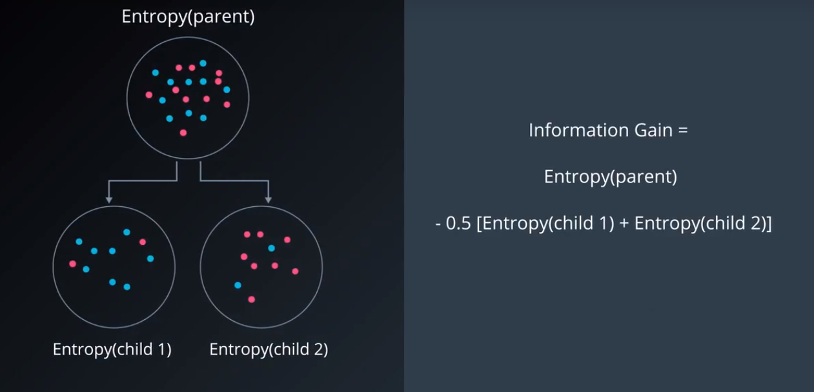

# 熵

Entropy:度量事物的不确定性，不确定性越高，熵就越大，反之越确定，熵越小；

随机事件(多类别)的熵可以表示为：

$$
entropy = -p_1log_2{(p1)} - p_2log_2(p2) - ... - p_nlog_2(p_n) = -\sum_{i=1}^n p_ilog_2(p_i)
$$

# 信息增益：

父结点的熵与子结点上的平均值之间的差值；



# 信息增益最大化

**每次决策都选择信息增益最大化的特征**


```python
import numpy as np
def two_group_ent(first, tot):                        
    return -(first/tot*np.log2(first/tot) + (tot-first)/tot*np.log2((tot-first)/tot))

tot_ent = two_group_ent(10, 24)                       
g_feature_17_ent = 15/24 * two_group_ent(11,15) + 9/24 * two_group_ent(6,9)                  

answer = tot_ent - g17_ent  

print(answer)
```

    0.11260735516748954


# 决策树的超参数

为了创建泛化能力好的决策树，我们可以调优决策树的多个方面。我们把决策树的这些可调优的多个方面称为“超参数”。以下是决策树中使用的一些最重要的超参数。

## 最大深度
决策树的最大深度就是从根到叶之间可能的最大长度。一个最大深度为 k 的决策树最多有$2^k$ 个叶子。

## 最少样本分割数

一个节点必须至少有min_samples_split个样本才能足够大以进行拆分。如果一个节点的样本数少于 min_samples_split 个， 则分割过程停止，该节点不会被分割。


然而 min_samples_split 不会控制叶的最小尺寸。正如你在上面右边的示例中看到的，父节点有20个样本，大于min_samples_split = 11，因此这个节点被拆分。但在此节点被拆分后，有一个子节点的样本数为5，小于min_samples_split = 11。

## 每片叶子的最小样本数

当分割一个节点时，可能会遇到的一个问题是分割不均匀，例如某个子节点有99个样本，另一个子节点可能只有1个样本。这会影响决策树的生成，也浪费计算资源和时间。为避免这种情况，我们可以为每个叶子上允许的样本数设置一个最小值。

## 每次分裂的最小样本数

这个参数与每片叶子上的最小样本树相同，只不过是应用在节点的分裂当中。


## 最大特征数
有时，我们会遇到特征数量过于庞大，而无法建立决策树的情况。在这种状况下，对于每一个分裂，我们都需要检查整个数据集中的每一个特征。这种过程极为繁琐。而解决方案之一是限制每个分裂中查找的特征数。如果这个数字足够庞大，我们很有可能在查找的特征中找到良好特征（尽管也许并不是完美特征）。然而，如果这个数字小于特征数，这将极大加快我们的计算速度。


# sklearn 中的决策树
对于决策树模型，你将使用 scikit-learn 的 Decision Tree Classifier 类。该类提供了定义模型并将模型与数据进行拟合的函数。


```
from sklearn.tree import DecisionTreeClassifier
model = DecisionTreeClassifier()
model.fit(x_values, y_values)
print(model.predict([ [0.2, 0.8], [0.5, 0.4] ]))
```

# 超参数
当我们定义模型时，可以指定超参数。在实践中，最常见的超参数包括：

max_depth：树中的最大层级数量。

min_samples_leaf：叶子允许的最低样本数量。

min_samples_split：拆分内部节点所需的最低样本数量。

max_features：寻找最佳拆分方法时要考虑的特征数量。

例如，在此例中，我们定义了一个模型：树的最大深度 max_depth 为7，每个叶子的最低元素数量 min_samples_leaf 是 10。

model = DecisionTreeClassifier(max_depth = 7, min_samples_leaf = 10)

# 构建决策树步骤：

## 1.构建决策树模型

使用 scikit-learn 的 DecisionTree 类构建决策树分类模型，并将其赋值给变量 model。

## 2.将模型与数据进行拟合

你不需要指定任何超参数，因为默认的超参数将以 100% 的准确率拟合数据。

但是，建议你实验这些超参数，例如 max_depth 和 min_samples_leaf，并尝试找到最简单的潜在模型，即最不太可能过拟合的模型！

## 3.使用模型进行预测

预测训练集的标签，并将此列表赋值给变量 y_pred。

## 4.计算模型的准确率

为此，使用 sklearn 函数 accuracy_score。


代码实现:


```python
# Import statements 
from sklearn.tree import DecisionTreeClassifier
from sklearn.metrics import accuracy_score
import pandas as pd
import numpy as np

# Read the data.
data = np.asarray(pd.read_csv('data.csv', header=None))
# Assign the features to the variable X, and the labels to the variable y. 
X = data[:,0:2]
y = data[:,2]

# TODO: Create the decision tree model and assign it to the variable model.
# You won't need to, but if you'd like, play with hyperparameters such
# as max_depth and min_samples_leaf and see what they do to the decision
# boundary.
model = DecisionTreeClassifier()

# TODO: Fit the model.
model.fit(X,y)
# TODO: Make predictions. Store them in the variable y_pred.
y_pred = model.predict(X)

# TODO: Calculate the accuracy and assign it to the variable acc.
acc = accuracy_score(y_pred, y)
```


```python
print(acc)
```

    1.0


```python

```
