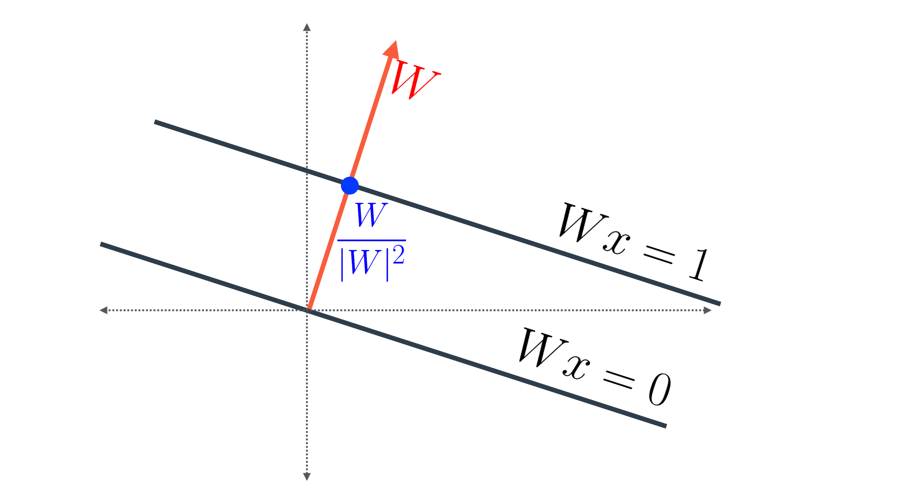
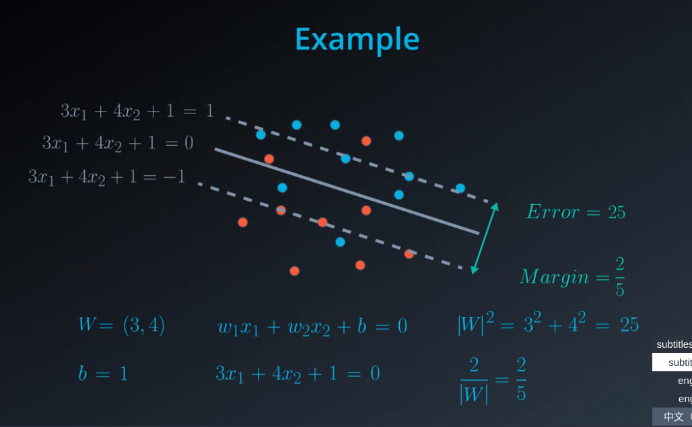
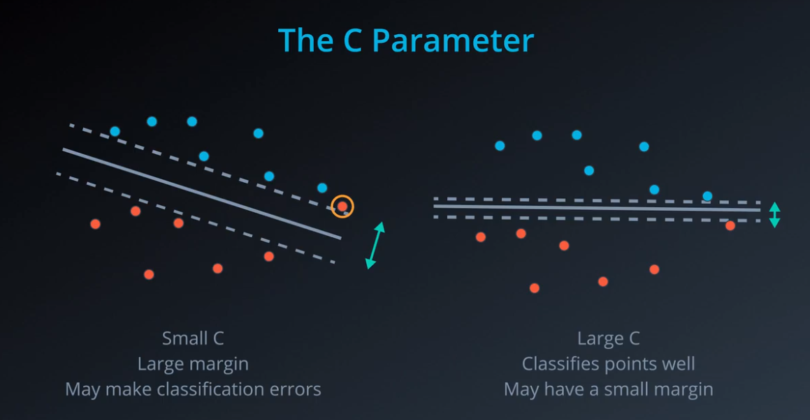
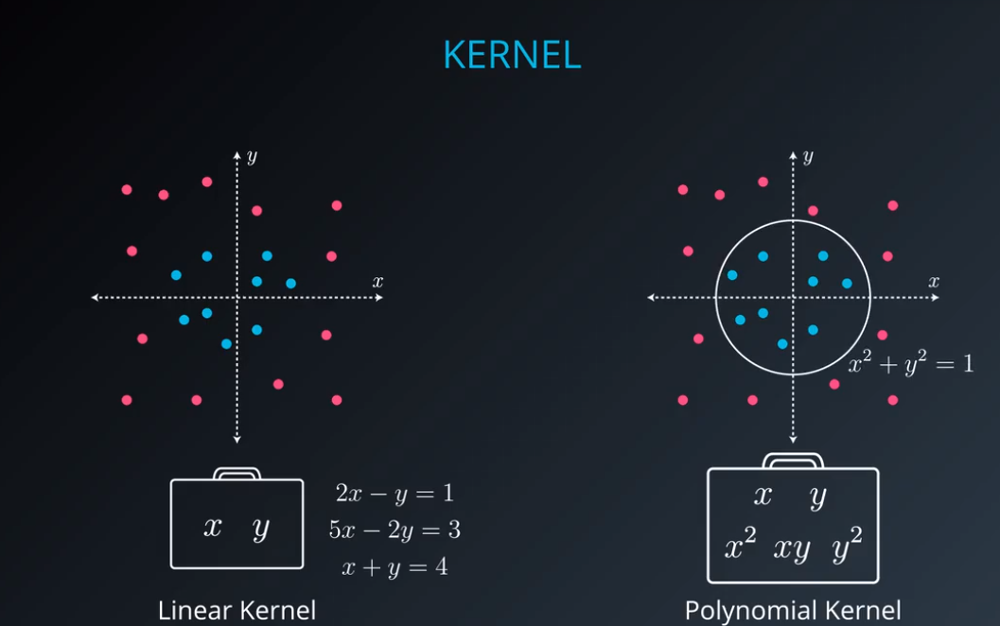
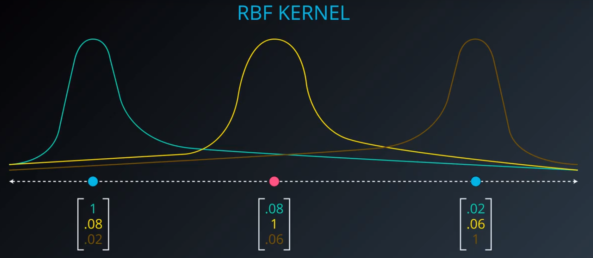
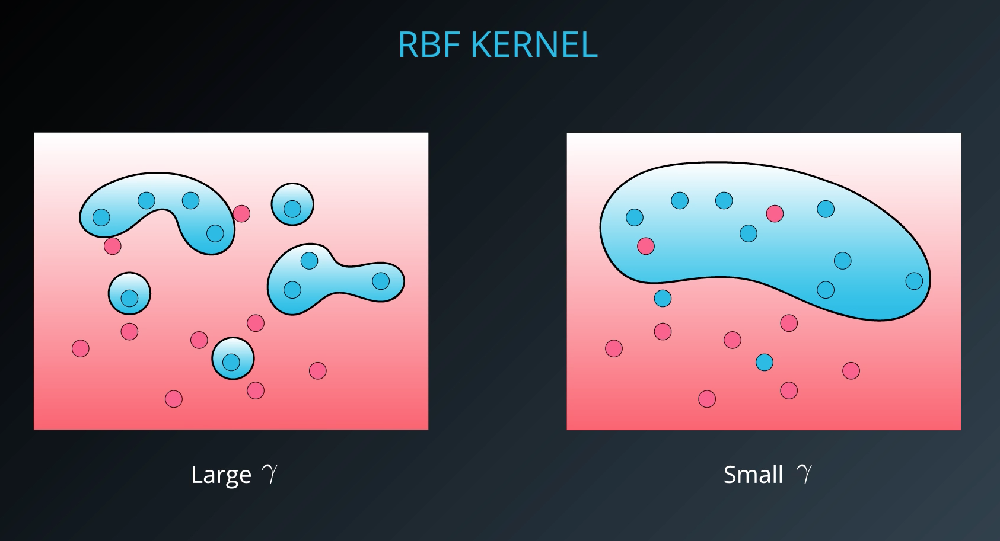

# 支持向量机（support vector machines）

是一种二分类模型，它的目的是寻找一个超平面来对样本进行分割，分割的原则是间隔最大化，最终转化为一个凸二次规划问题来求解。

由简至繁的模型包括：

当训练样本线性可分时，通过硬间隔最大化，学习一个线性可分支持向量机；

当训练样本近似线性可分时，通过软间隔最大化，学习一个线性支持向量机；

当训练样本线性不可分时，通过核技巧和软间隔最大化，学习一个非线性支持向量机


# 距离最小化：

最近的点，哪个离线更远；距离越大，分类越优


# 误差最小化

度量模型，一种是看误分类多少点，一种是看间隔多宽，

margin最大化，误差越小


## 边际误差计算

首先，$W = (w_1, w_2),x = (x_1,x_2), 并且 Wx = w_1x_1 + w_2x_2$ 


请注意，在这里我们有三条线，方程如下：

Wx+b=1

Wx+b=0

Wx+b=-1

该向量与方程为 Wx=1的线条相交于蓝点。假设该点的坐标为 (p,q)。那么我们可以得到下面两个结果：

$w_1p + w_2q = 1$（由于该点位于这条线上），并且

由于该点位于向量 $W = (w_1, w_2)$上(p,q) 是 $(w_1, w_2)$的倍数。

我们可以这样求解这个方程：对于某个 k 值而言，有 $(p,q) = k(w_1, w_2)$

那么我们的第一个方程将被转换为 $k(w_1^2 + w_2^2) = 1$

因此，$k = \frac{1}{w_1^2+w_2^2} = \frac{1}{|W|^2}$。这也就是说，蓝点表示向量 $\frac{W}{|W|^2} $
如图所示。



最后，最终距离是这连续两条平行线之间的距离之和。由于每两条线之间的距离为$\frac{1}{|W|} ，那么总距离为 \frac{2}{|W|} 。$

# 误差函数

误差函数是分类误差和边际误差的总和，通过梯度下降法，最小化误差函数，




# C参数

根据不同的应用场景，有时需要更高的准确性，有时需要更好的泛化能力，这种灵活性，通过C参数来提供。



如果C较大，更关注数据的正确分类，而不是寻找更合适的间隔；

如果C较小，那大部分误差就是边际误差，此时更注重合适的间隔，而不是数据准确性；


注意: 当 C 值对一组特定数据太大时，你可能根本无法收敛，因为总会有些分类错误的点不能被成功分离。

我们看到了支持向量机的三种不同实现方法：

最大间隔分类器

线性不可分类型的分类

核方法


## 核方法

最后，我们学习核方法，它使支持向量机真正强大。支持向量机中的核方法，使我们能在线性不可分情况下分离数据。

具体来说，你看到了两种类型的核:

多项式

径向基函数 (rbf)

### 多项式核



### 径向基函数 (rbf)

当前最流行的核是 rbf（径向基函数）。rbf 核使你有可能对在任何空间都难以分离的点进行分类。

一维



二维


也就是说对于原有数据集，添加一个维度，就可以分离任何空间；

这是一种观察点间紧密程度的基于密度的方法。 这里引入另一个超参数 gamma。

当 gamma 取较大值时，其结果类似于C有较大值，即你的**算法将尝试正确分类所有的点**。于此相对，

当 gamma 较小时, 你的算法将尝试以更泛化方式进行分类，**这样会增加分类错误，但会提高泛化能力**。



# sklearn中的支持向量机


```python
# Import statements 
from sklearn.svm import SVC
from sklearn.metrics import accuracy_score
import pandas as pd
import numpy as np
```


```python
# Read the data.
data = np.asarray(pd.read_csv('data.csv', header=None))
# Assign the features to the variable X, and the labels to the variable y. 
X = data[:,0:2]
y = data[:,2]
```


```python
#加载模型
# TODO: Create the model and assign it to the variable model.
# Find the right parameters for this model to achieve 100% accuracy on the dataset.
model = SVC(kernel='rbf', gamma=30)

# TODO: Fit the model.
model.fit(X,y)
```


    SVC(C=1.0, cache_size=200, class_weight=None, coef0=0.0,
        decision_function_shape='ovr', degree=3, gamma=30, kernel='rbf',
        max_iter=-1, probability=False, random_state=None, shrinking=True,
        tol=0.001, verbose=False)


```python
# TODO: Make predictions. Store them in the variable y_pred.
y_pred = model.predict(X)

# TODO: Calculate the accuracy and assign it to the variable acc.
acc = accuracy_score(y, y_pred)
```


```python
print(acc)
```

    1.0


```python

```


```python

```
