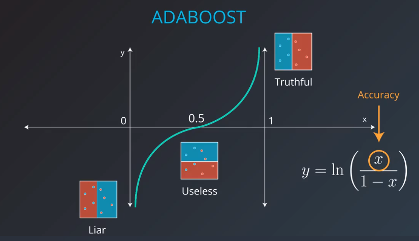
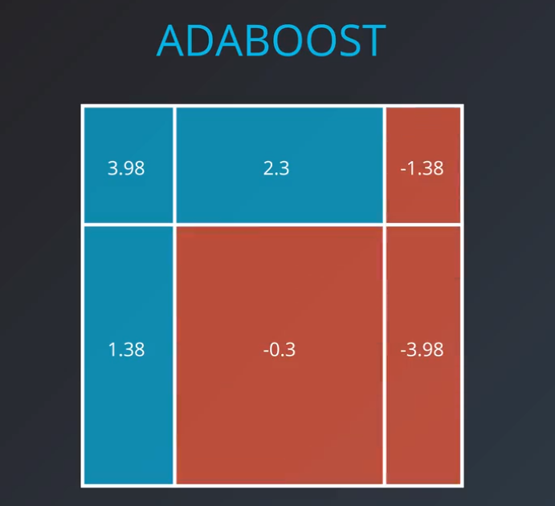

# 集成
这个单元（集成）的所有课程， 都是介绍如何把我们前面学过的简单模型组合（或集成）成一个集成模型，使集成模型比单个模型更好地预测。

通常来说，决策树是一个“弱”学习器。实际上，大多数集成方法都默认使用sklearn中的决策树。但是，你可以将此值更改为任何我们前面看过的模型。

为什么要把学习器集成在一起？
找到一个拟合能力好的机器学习模型要看两个相互竞争的变量：**偏差**和**方差**.
首先, [这篇维基百科的文章很有用](https://en.wikipedia.org/wiki/Bias%E2%80%93variance_tradeoff)

**偏差**：当一个模型有高偏差，这意味它弹性差（欠拟合），不能很好拟合数据。通常具有高偏差的算法的例子是线性回归。即使是完全不同的数据集，线性回归模型的输出结果确是同一条直线。模型的偏差高是不好的。


**方差**：当模型有高方差，这意味它会剧烈变化（过拟合），以满足数据集中每个点的需求。上图中的线性模型是低方差和高偏差的例子。决策树（特别是没有早期停止参数的决策树）则是一种倾向于高方差和低偏差的例子。决策树作为一种高方差算法，倾向于将每个点尽可能分割成一个独立的分支。这是高方差、低偏差算法的一个特点：它们非常灵活，可以精确地拟合所见的任何数据。


用集成算法，我们可以通过权衡偏差和方差来生成一个更好的模型。还有一些其他的策略用于组合算法，以帮助它们更好地工作。这些思想是基于数学理论的最小偏差和方差，如中心极限定理。

### 将随机性引入集成

另一种用于改进集成算法的方法是先将随机性引入高方差算法，再进行集成。随机性的引入消除了这些算法的过拟合（或直接拟合数据）的趋势。引入随机性的方法主要有两种：

1.**数据的自助采样法** - 也就是说，对数据先使用自助采样(或有放回的采样)，再用算法拟合采样数据。

2.**特征子集法** - 在决策树的每次分支中，或在使用集成的每个算法时，只使用全部可用特征的子集。

实际上，这是我们将看到的下一个算法中使用的两个随机组件，称为**随机森林**。

# 随机森林

从数据中随机选择一个子特征列，并根据这些列构建决策树，然后再选取其他列，再次构造决策树...

然后让决策树选择，对于一个新数据，让所有决策树作出预测，并选取结果最多的项作为最终预测结果。


# BAGGING

选取多个数据集的子集(可以放回抽样)，用每个子集训练弱学习器，最后再把这些若学习器组合起来，


对所有若学习器预测结果，选择最大概率的为强学习器结果。


# ADABOOST

核心思想：

先拟合第一个学习器，最大化准确度，或最小化误差，保存这个模型；


第二个弱学习器，要修正第一个学习器的错误，把第一个模型误分类的点放大，换句话说，就是第二个模型漏掉这些误分类点，就加大惩罚；


第三个弱学习器，继续对错误分类的点加大惩罚；


重复这个过程，得到一组弱学习器；

最后，组合这些弱学习器模型，这就是拟合数据后得到的模型


# 数据权重

先把每个数据点的初始权重设置为1, 分类后将正确分类的权重加起来，


然后将误分类点的权重提高点(一般取正/错比50：50)，


第二个模型，将重点对新增加权重的数据进行拟合，并且继续提高误分类点的权重（模型再次回到50：50）；


继续重复，创建足够的弱分类模型

# 模型权重

创建的多个模型，每个都分配相应的权重，用一个公式来表述。




$$
weight = ln(\frac{accuracy}{1-accuracy})
$$
公式可以改写为：

$$
weight = ln(\frac{\#correct}{\#incorrect})
$$

注意除零问题，当准确率为1,或者0时，上式可能除零，实际应用中这种很小，万一出现独立处理：

准确度为1,意味着所有分类都正确，只用这一个若分类器；

准确度为0,所有分类都错误，也只需要用这一个分类其即可，将预测结果置反；

## Boosting（提升算法）相关的其他资源

1.[原论文](https://cseweb.ucsd.edu/~yfreund/papers/IntroToBoosting.pdf) - Yoav Freund & Robert E.Schapire 写的关于 Boosting 的原论文链接。

2.[为什么 boosting（提升算法）很重要](https://yq.aliyun.com/articles/71144) - Kaggle 大师 Ben Gorman 写的关于 boosting（提升算法）的一篇好文章。

3.[一个有用的 Quora 帖子](https://www.quora.com/What-is-an-intuitive-explanation-of-Gradient-Boosting) - 关于 boosting 的一些有用的解释。

上面例子的权重计算如下：


对三个弱学习器进行组合，叠加权重值，为正，就认为是蓝点，否则为红点，这样就拟合了一个枪击学习器；



# sklearn 中的 AdaBoost

>>> from sklearn.ensemble import AdaBoostClassifier
>>> model = AdaBoostClassifier()
>>> model.fit(x_train, y_train)
>>> model.predict(x_test)

model 变量是一个决策树模型，

## 超参数
当我们定义模型时，我们可以确定超参数。在实际操作中，最常见的超参数为：

base_estimator：弱学习器使用的模型（切勿忘记导入该模型）。

n_estimators：使用的弱学习器的最大数量。

比如，在下面的例子中，我们定义了一个模型，它使用 max_depth 为 2 的决策树作为弱学习器，并且它允许的弱学习器的最大数量为 4。
```
from sklearn.tree import DecisionTreeClassifier
model = AdaBoostClassifier(base_estimator = DecisionTreeClassifier(max_depth=2), n_estimators = 4)
```

# 小结：

学习了集成算法中的许多常用技术。在开始研究这些技术之前，看到两个需要权衡的变量偏差和方差。

**高偏差，低方差**: 模型不够灵活，常会欠拟合。线性模型属于这类模型。

**高方差，低偏差**: 模型因为太灵活，往往会过拟合。决策树属于这类模型。

**集成算法**

为了能同时对方差和偏差做优化，我们采用集成算法。集成方法已成为在Kaggle比赛上最流行的方法之一，并在现实行业中广泛使用。

有两种随机化技术可以防止过拟合:

**数据的自助采样法** - 也就是说，对数据先使用自助采样(或有放回的采样)，再用算法拟合采样数据。

**特征子集法** - 在决策树的每次分支中，或在使用集成的每个算法时，只使用全部可用特征的子集。

本课程中看到了许多集成方法，包括：

[Bagging分类器](https://scikit-learn.org/stable/modules/generated/sklearn.ensemble.BaggingClassifier.html#sklearn.ensemble.BaggingClassifier)

[RandomForest分类器](https://scikit-learn.org/stable/modules/generated/sklearn.ensemble.RandomForestClassifier.html#sklearn.ensemble.RandomForestClassifier)

[AdaBoost分类器](http://scikit-learn.org/stable/modules/generated/sklearn.ensemble.AdaBoostClassifier.html#sklearn.ensemble.AdaBoostClassifier)

另一个非常有用的集成算法指南可以在[这个文档](https://scikit-learn.org/stable/modules/ensemble.html)中找到。这些方法也可以用来解决回归问题，不仅仅是分类问题。

## 其他资源

此外，如果你想更多的了解Adaboost相关知识，这里有一些很棒的资源！

这是 Freund 和 Schapire 的 [原论文](https://cseweb.ucsd.edu/~yfreund/papers/IntroToBoosting.pdf)

Freund 和 Schapire 的 [后续论文](https://people.cs.pitt.edu/~milos/courses/cs2750/Readings/boosting.pdf)，关于 Adaboost 的几种试验

Schapire 撰写的一个很好的 [教程](http://rob.schapire.net/papers/explaining-adaboost.pdf)


```python

```
