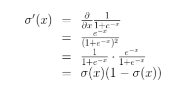
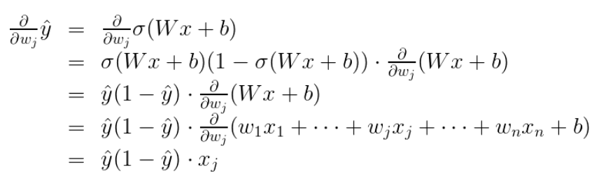
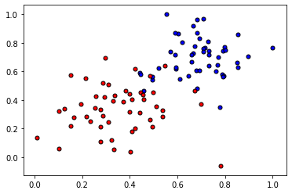
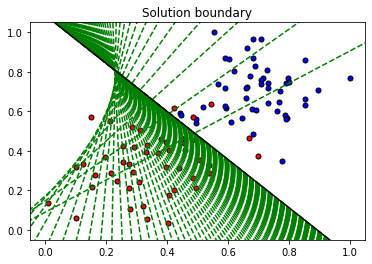
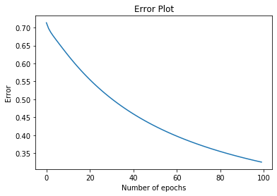

# 实现梯度下降算法

算法原理网上很多，我这里只是作为自己学习过程的札记，方便自己查看复习，因此不会那么详细，一般只记录对自己有用的部分。


## 1.什么是梯度？

可以简单理解为多变量函数的导数，即对每个变量单独求偏导。

梯度是改变率或者斜度的另一个称呼。如果你需要回顾这个概念，可以看下可汗学院对这个问题的[讲解](https://www.khanacademy.org/math/multivariable-calculus/multivariable-derivatives/gradient-and-directional-derivatives/v/gradient)。

梯度：https://www.khanacademy.org/math/multivariable-calculus/multivariable-derivatives/gradient-and-directional-derivatives/v/gradient

避免局部最低点方法:
    
https://ruder.io/optimizing-gradient-descent/index.html#momentum

可汗学院微积分：https://www.khanacademy.org/math/multivariable-calculus

向量：https://www.khanacademy.org/math/linear-algebra/vectors-and-spaces/vectors/v/vector-introduction-linear-algebra

矩阵：https://www.khanacademy.org/math/precalculus-2018/precalc-matrices


## 2.误差函数

**首先，误差函数是可微的，连续的；**

这里用均方差（mean of the square errors，MSE）

$$
E = \frac{1}2m\sum_{\mu=1}^{m}(y^{\mu}-\hat{y}^\mu)^2
$$

## 3.梯度下降的基本过程：

这个函数就代表着一座山。我们的目标就是找到这个函数的最小值，也就是山底。

最快的下山的方式就是找到当前位置最陡峭的方向(梯度方向)，然后沿着此方向向下走，因为梯度的方向就是函数之变化最快的方向；

重复这个过程，反复求取梯度，最后就能到达局部的最小值，这就类似于我们下山的过程。

## 4.实现基本函数

实现以下基本函数。

- Sigmoid 激活函数

$$\sigma(x) = \frac{1}{1+e^{-x}}$$

- 输出（预测）公式

$$\hat{y} = \sigma(w_1 x_1 + w_2 x_2 + b)$$

- 误差函数

$$Error(y, \hat{y}) = - y \log(\hat{y}) - (1-y) \log(1-\hat{y})$$

- 更新权重的函数

$$ w_i^{'} \longleftarrow w_i + \alpha (y - \hat{y}) x_i$$

$$ b^{'} \longleftarrow b + \alpha (y - \hat{y})$$

## 5.梯度计算公式推导

首先要注意的是 s 型函数具有很完美的导数。即

$$
\sigma'(x) = \sigma(x) (1-\sigma(x)) 
 $$

原因是，我们可以使用商式计算它：


现在，如果有 m  个样本点，标为$ x^{(1)}, x^{(2)}, \ldots, x^{(m)}$

误差公式是：$E = -\frac{1}{m} \sum_{i=1}^m \left( y^{(i)} \ln(\hat{y^{(i)}}) + (1-y^{(i)}) \ln (1-\hat{y^{(i)}}) \right)$ 

预测是 $\hat{y^{(i)}} = \sigma(Wx^{(i)} + b)$

我们的目标是计算E, 在单个样本点 x 时的梯度（偏导数），其中 x 包含 n 个特征，即$ x = (x_1, \ldots, x_n),$

$$
\nabla E =\left(\frac{\partial}{\partial w_1}E, \cdots, \frac{\partial}{\partial w_n}E, \frac{\partial}{\partial b}E \right) 
$$
为此，首先我们要计算， $\frac{\partial}{\partial w_j} \hat{y} $

因为这是上述公式里的第一个元素。$\hat{y} = \sigma(Wx+b)$

因此：




最后一个等式是因为和中的唯一非常量项相对于 $w_j$  正好是 $w_j x_j$, 明显具有导数 $x_j$. 

现在可以计算 $\frac {\partial} {\partial w_j} E$ 


类似的计算将得出,针对单个样本点时，E 对 b 求偏导的公式为：$ \frac {\partial} {\partial b} E=-(y -\hat{y}) $


这个实际上告诉了我们很重要的规则。对于具有坐标$ (x_1, \ldots, x_n)$ 的点，标签 y,预测$\hat{y}$, 该点的误差函数梯度是

$$ \left(-(y - \hat{y})x_1, \cdots, -(y - \hat{y})x_n, -(y - \hat{y}) \right) $$

总之

$$\nabla E(W,b) = -(y - \hat{y}) (x_1, \ldots, x_n, 1) $$

如果思考下，会发现很神奇。梯度实际上是标量乘以点的坐标！什么是标量？也就是标签和预测之间的差别。这意味着，如果标签与预测接近（表示点分类正确），该梯度将很小，如果标签与预测差别很大（表示点分类错误），那么此梯度将很大。请记下：小的梯度表示我们将稍微修改下坐标，大的梯度表示我们将大幅度修改坐标。

如果觉得这听起来像感知器算法，其实并非偶然性！

## 4.梯度下降法更新权重的算法概述：

1.权重步长设定为 0： $\Delta w_i = 0$

2.对训练数据中的每一条记录：

a.通过网络做正向传播，计算输出 $\hat y = f(\sum_i w_i x_i)$ 

b.计算输出单元的误差项（error term） $\delta = (y - \hat y) * f'(\sum_i w_i x_i)$

c.更新权重步长 $\Delta w_i = \Delta w_i + \delta x_i$

d.更新权重 $w_i = w_i + \eta \Delta w_i / m$. 其中 $\eta$ 是学习率， m 是数据点个数。这里我们对权重步长做了平均，为的是降低训练数据中大的变化。

3.重复 e 代（epoch）。

你也可以对每条记录更新权重，而不是把所有记录都训练过之后再取平均。

## 读取与绘制数据


以一个二维平面点集的二分类为例，用梯度下降法拟合直线；


```python
import matplotlib.pyplot as plt
import numpy as np
import pandas as pd

#Some helper functions for plotting and drawing lines

def plot_points(X, y):
    admitted = X[np.argwhere(y==1)]
    rejected = X[np.argwhere(y==0)]
    plt.scatter([s[0][0] for s in rejected], [s[0][1] for s in rejected], s = 25, color = 'blue', edgecolor = 'k')
    plt.scatter([s[0][0] for s in admitted], [s[0][1] for s in admitted], s = 25, color = 'red', edgecolor = 'k')

def display(m, b, color='g--'):
    plt.xlim(-0.05,1.05)
    plt.ylim(-0.05,1.05)
    x = np.arange(-10, 10, 0.1)
    plt.plot(x, m*x+b, color)
```


```python
data = pd.read_csv('data.csv', header=None)
X = np.array(data[[0,1]])
y = np.array(data[2])
plot_points(X,y)
plt.show()
```





由上图可明显观测两个类别点集，用线性回归可以分类


```python
# Implement the following functions

# Activation (sigmoid) function
# 激活函数
def sigmoid(x):
    return 1 / (1 + np.exp(-x))

# Output (prediction) formula
# 感知器输出
def output_formula(features, weights, bias):
    return sigmoid(np.dot(features, weights) + bias)

# Error (log-loss) formula
# 误差函数
def error_formula(y, output):
    return - y*np.log(output) - (1 - y) * np.log(1-output)

# Gradient descent step
# 用梯度更新权重
def update_weights(x, y, weights, bias, learnrate):
    output = output_formula(x, weights, bias)
    d_error = (y - output)
    weights += learnrate * d_error * x
    bias += learnrate * d_error
    return weights, bias
```

## 训练函数

该函数将帮助我们通过所有数据来迭代梯度下降算法，用于多个 epoch。 它还将绘制数据，以及在我们运行算法时绘制出一些边界线。


```python
np.random.seed(44)

epochs = 100
learnrate = 0.01

def train(features, targets, epochs, learnrate, graph_lines=False):
    
    errors = []
    n_records, n_features = features.shape
    last_loss = None
    #获得随机值
    weights = np.random.normal(scale=1 / n_features**.5, size=n_features)
    bias = 0
    for e in range(epochs):
        del_w = np.zeros(weights.shape)
        for x, y in zip(features, targets):
            output = output_formula(x, weights, bias)
            error = error_formula(y, output)
            weights, bias = update_weights(x, y, weights, bias, learnrate)
        
        # Printing out the log-loss error on the training set
        out = output_formula(features, weights, bias)
        loss = np.mean(error_formula(targets, out))
        errors.append(loss)
        if e % (epochs / 10) == 0:
            print("\n========== Epoch", e,"==========")
            if last_loss and last_loss < loss:
                print("Train loss: ", loss, "  WARNING - Loss Increasing")
            else:
                print("Train loss: ", loss)
            last_loss = loss
            predictions = out > 0.5
            accuracy = np.mean(predictions == targets)
            print("Accuracy: ", accuracy)
        if graph_lines and e % (epochs / 100) == 0:
            display(-weights[0]/weights[1], -bias/weights[1])
            

    # Plotting the solution boundary
    plt.title("Solution boundary")
    display(-weights[0]/weights[1], -bias/weights[1], 'black')

    # Plotting the data
    plot_points(features, targets)
    plt.show()

    # Plotting the error
    plt.title("Error Plot")
    plt.xlabel('Number of epochs')
    plt.ylabel('Error')
    plt.plot(errors)
    plt.show()
```

## 是时候来训练算法啦！

当我们运行该函数时，我们将获得以下内容：

- 目前的训练损失与准确性的 10 次更新
- 获取的数据图和一些边界线的图。 最后一个是黑色的。请注意，随着我们遍历更多的 epoch ，线会越来越接近最佳状态。
- 误差函数的图。 请留意，随着我们遍历更多的 epoch，它会如何降低。


```python
train(X, y, epochs, learnrate, True)
```

    
    ========== Epoch 0 ==========
    Train loss:  0.7135845195381634
    Accuracy:  0.4
    
    ========== Epoch 10 ==========
    Train loss:  0.6225835210454962
    Accuracy:  0.59
    
    ========== Epoch 20 ==========
    Train loss:  0.5548744083669508
    Accuracy:  0.74
    
    ========== Epoch 30 ==========
    Train loss:  0.501606141872473
    Accuracy:  0.84
    
    ========== Epoch 40 ==========
    Train loss:  0.4593334641861401
    Accuracy:  0.86
    
    ========== Epoch 50 ==========
    Train loss:  0.42525543433469976
    Accuracy:  0.93
    
    ========== Epoch 60 ==========
    Train loss:  0.3973461571671399
    Accuracy:  0.93
    
    ========== Epoch 70 ==========
    Train loss:  0.3741469765239074
    Accuracy:  0.93
    
    ========== Epoch 80 ==========
    Train loss:  0.35459973368161973
    Accuracy:  0.94
    
    ========== Epoch 90 ==========
    Train loss:  0.3379273658879921
    Accuracy:  0.94







