```python
有时候我们去训练神经网络，发现结果并非预期那样，什么原因？

有很多原因导致出现问题，也许设计的结构不合适，数据有太多瑕疵，模型需要可能需要好几年的运行时间，我们需要学习
各种方法来优化模型训练过程。
```


      File "<ipython-input-1-c09953d2dfac>", line 1
        有时候我们去训练神经网络，发现结果并非预期那样，什么原因？
                                    ^
    SyntaxError: invalid character in identifier


# 神经网络调试方法：


# 过拟合问题

## 1.早期停止法：

将每个epoch的误差绘制成图表，画出训练误差和测试误差的曲线

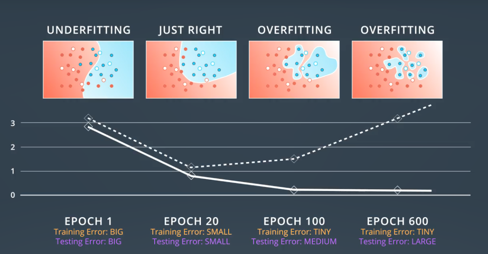

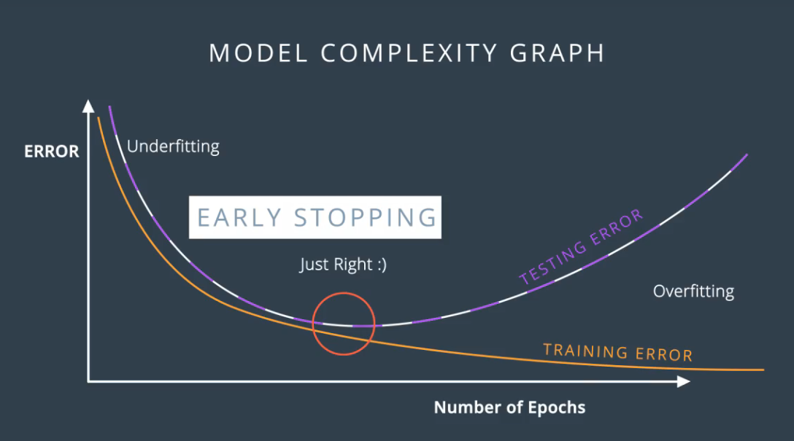

降低梯度，知道测试误差停止降低并开始增大。这个临界点就是最合适的epoch。这个方法广泛用于训练神经网络。

## ２.正则化
当用一条直线来分类两个点时：

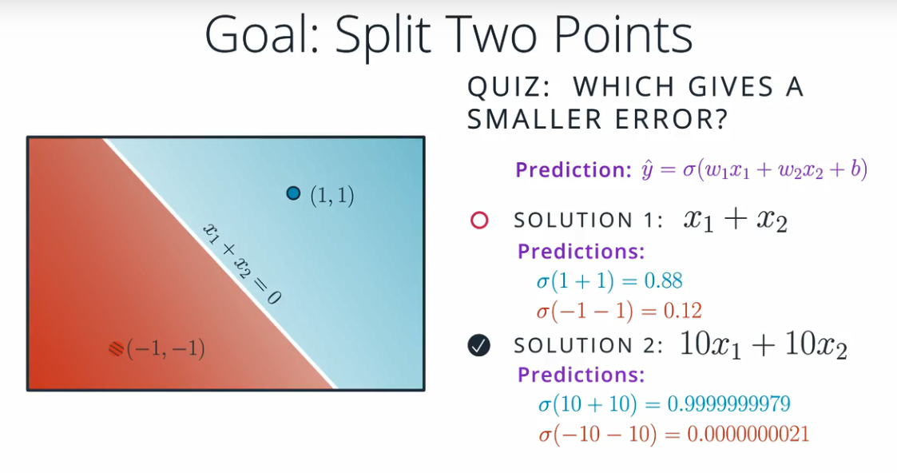

可见参数越大，分类越准确，将两组系数投射到sigmod函数中，

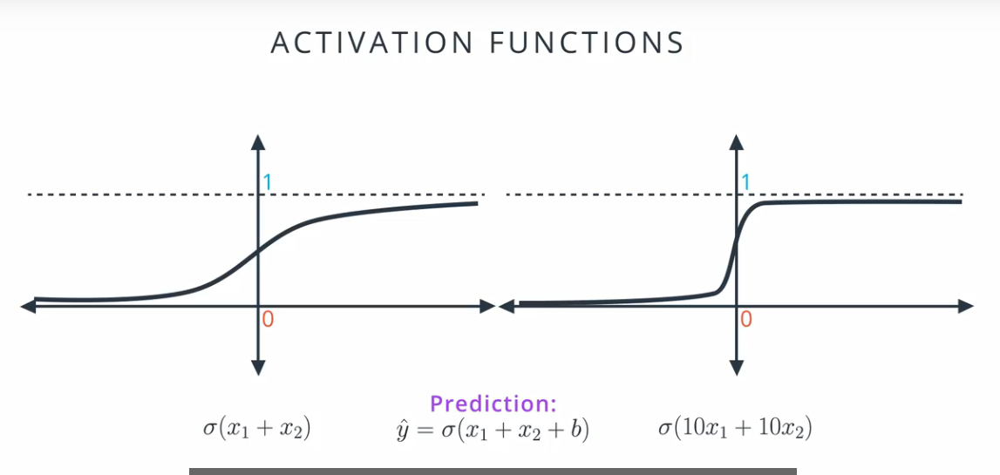

可见，系数较小时，可以得到更好的梯度下降坡度；

把系数乘以10后，函数更加陡峭，预测更加准确，但是很难进行较大幅度的下降，因为导数要么接近0，要么非常大，所以为了合理使用梯度下降法，

我们更倾向使用左边的模型；

右侧模型太稳定，很难运用梯度下降法，错误的点会产生更大的误差，很难调优模型。

伯特兰罗素：

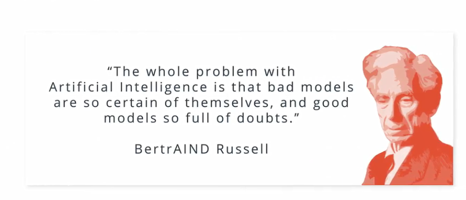

由于错误的模型提供了较小的误差，我们对误差函数稍作调整，大体来说，想要惩罚高系数。

利用原来的误差函数，权重大时，添加较大的一项，有两种方法：加上权重乘以常量绝对值的和，或者加上权重平方总和乘以参数。

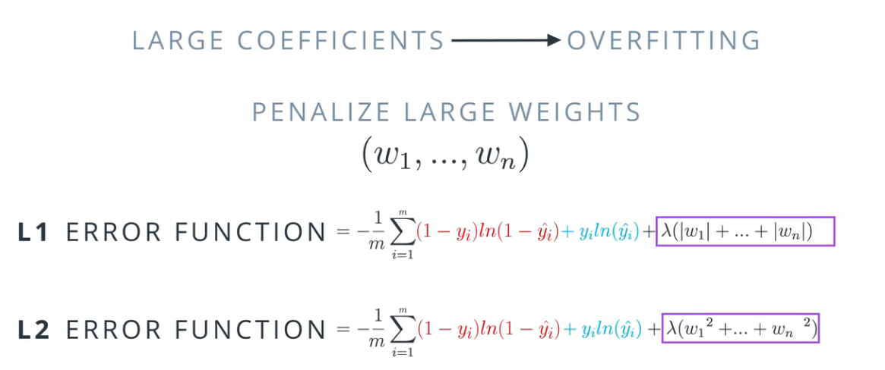

参数$\lambda$表征惩罚的力度。


对于L1正则化和L2正则化，有一些通用规则，

使用L1正则化时，我们希望得到稀疏向量，表示较小权重趋向于0；如果我们想降低权重值，最总得到较小的数，可以使用L1正则化；
有利于特征选择，有时候会遇到大量特征，L1正则化可以选择哪些更重要，然后将其与变成0.

L2正则化不支持稀疏向量(原因见下图)，它确保所有权重一致小，这个一般可以训练模型，得出更好结果，

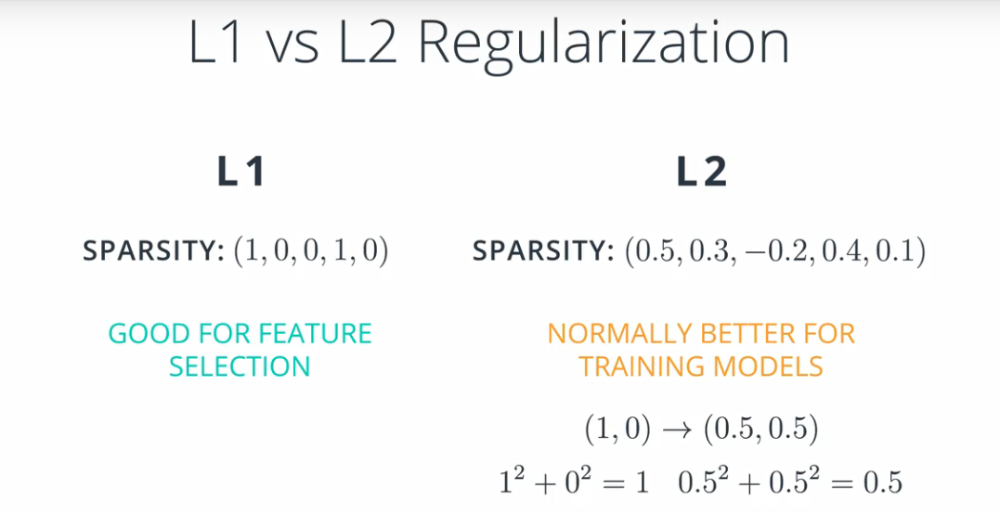

## 3.Dropout

训练神经网络的时候，某些部分权重非常大，最终对训练起主要作用，而另一部分并没有起到多大作用，所以没有被训练到，

在训练过程中，随机关闭某些节点，这样其他节点承担主要责任，在训练中起到更大作用，


我们放弃一些节点的方式，是给算法一个参数，该参数是每个节点在某个特定epoch被放弃的概率；平均下来，每个节点都会得到相同的处理，这个方法叫dropout
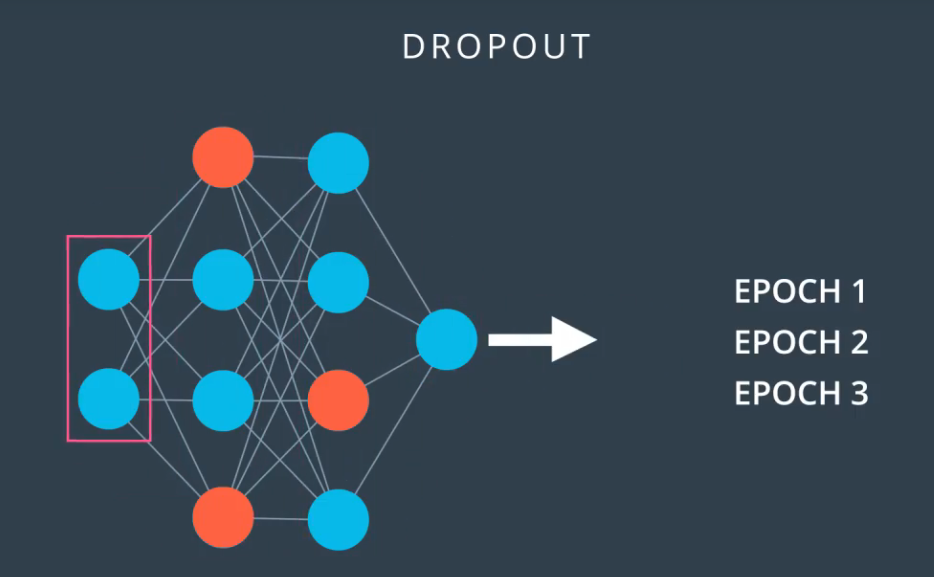


# 局部最低点及梯度消失问题

如下图，当采用梯度下降来到这点后，没有任何方向可以下降；

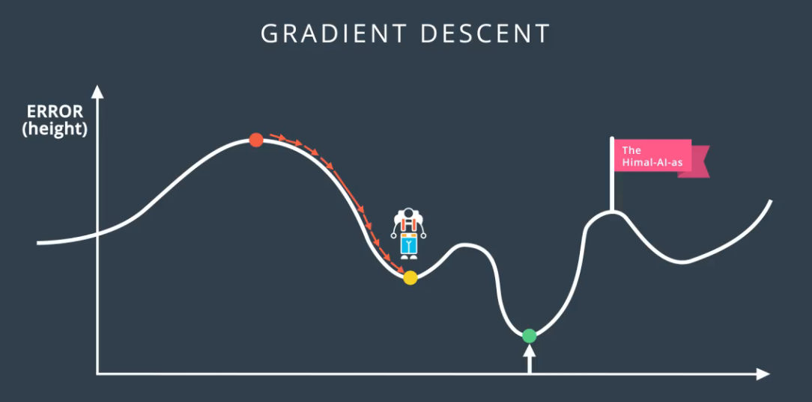

还有个问题，在sigmod函数两端，曲线非常平缓，导数接近0，这样不好

因为导数可以告诉我们移动方向，

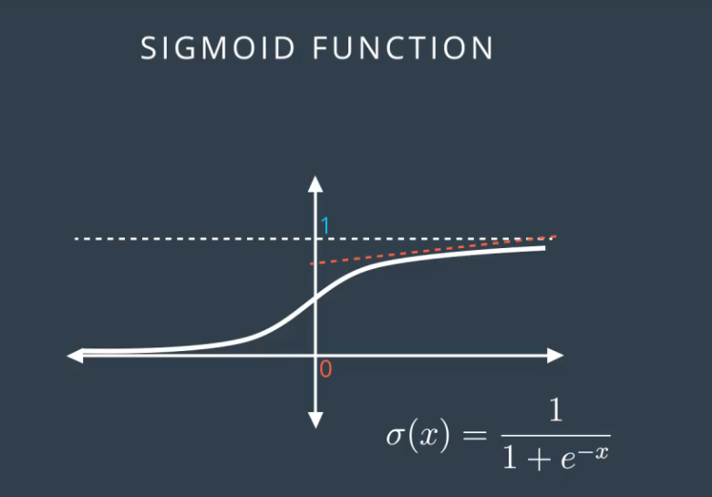

在多层线性感知器中，情况更糟糕，误差函数相对于权重的导数，是在输出对应的路径上的节点，所有的导数的积；

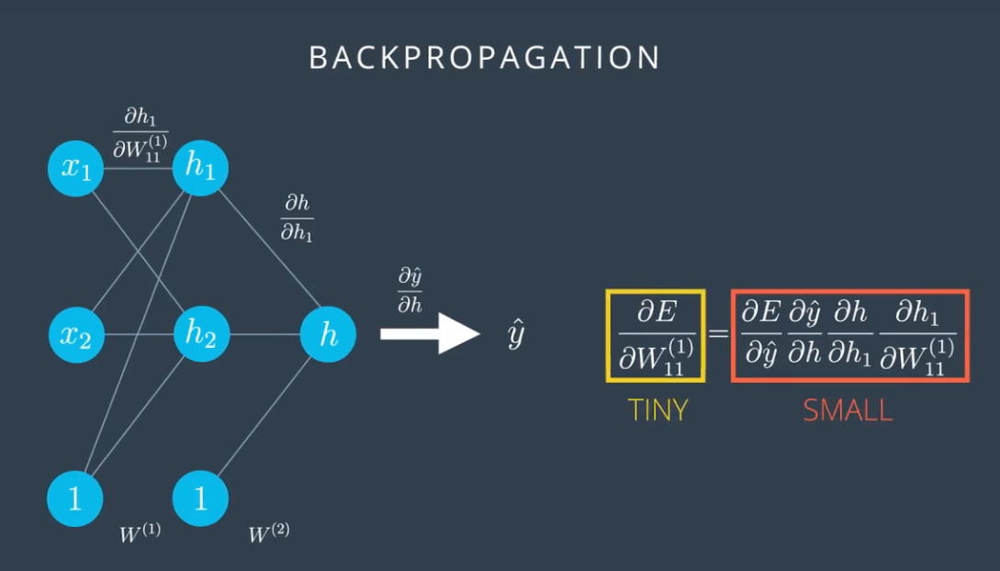
假如都是s型导数，这个值会很小，这样使得训练过程变得很难，因为梯度下降使我们对权重的更改非常非常小(可能接近0)，这样训练速度会非常慢，甚至会让我们在珠峰无法下降；

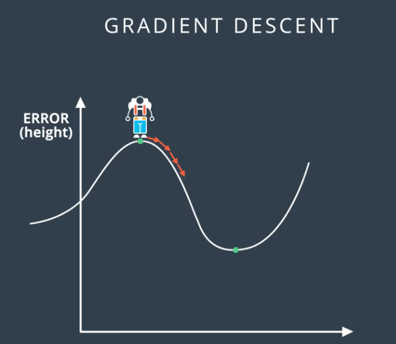

## 解决办法：

1.最好方法是改变激活函数

比如，双曲正切函数，

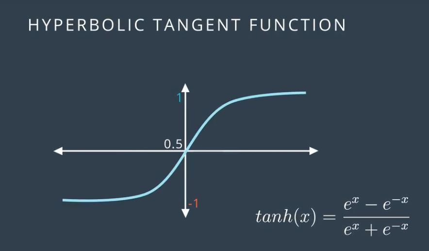


这个公式与sigmod函数很想，不过由于范围在-1和1之间，导数更大，这个较小区别，在神经网络中产生巨大进步；

## 线性修正单元ReLU

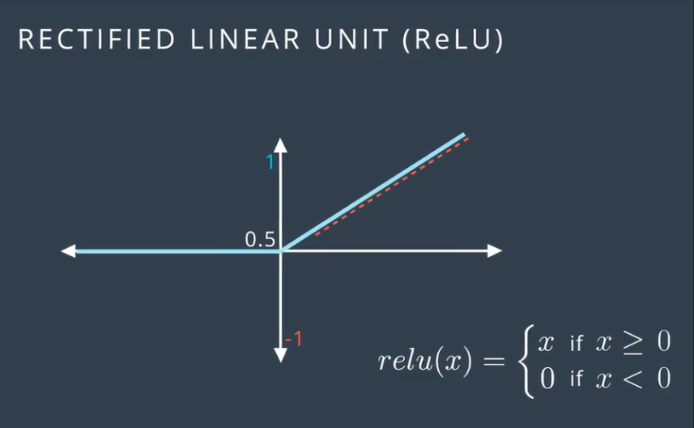
这是另一个非常流行的激活函数，可以在不牺牲精确度的前提下，极大提高训练效率。有趣的是，这个函数很少会打破线性得出复杂的非线性解

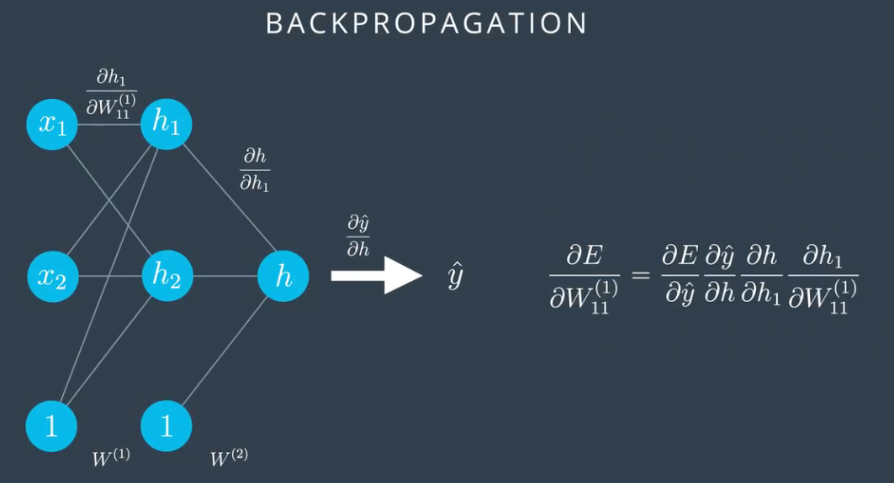

这样，获得任何权重导数时，可以获得更大乘积，可以进行合理梯度下降；

通过绘制函数，展现ReLU单元，这是一个包含一批ReLU激活单元的多层感知器例子；


注意，最后一个单元是sigmoid，因为我们最后的输出需要的是0到1的概率。


## 随机梯度下降法

**epoch**

epoch：就是梯度下降的一步。

在每个epoch中，让所有数据，完成整个神经网络，然后做出预测，计算误差，最后反向传播，更新神经网络中的权重，这样得到一个更好的分类界限。

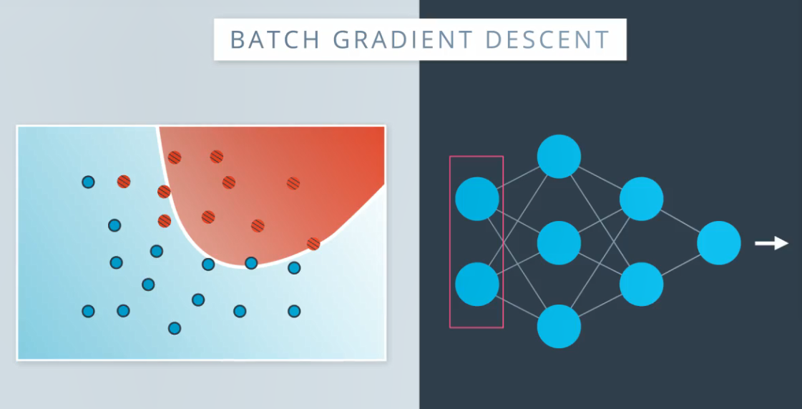

如果数据量很大时，这些计算就是很大的矩阵计算过程，占用大量内存，而这仅仅是一个步长。

**随机梯度下降**：原理很简单，拿出一小部分数据，让它们经历整个神经网络，根据这些点计算误差函数的梯度，然后沿着该方向移动一个步长，得到更好权重，重复这个过程，直至训练完所有数据，对于数据，执行了多个步长，但是对于普通梯度下降仅仅对所有数据执行了一个步长。当然，采取的多个步长精确度很低，
但现实中，采取大量不太准确的步长，比采取一个很精确的步长要好很多。

**注意**：随机梯度下降法，对数据的子集划分，必须采用随机选取。

## 学习速率

学习速度太大，靠近最低点时会引起模型混乱，速率太小，更可能达到局部最低值，但训练速度会更慢。

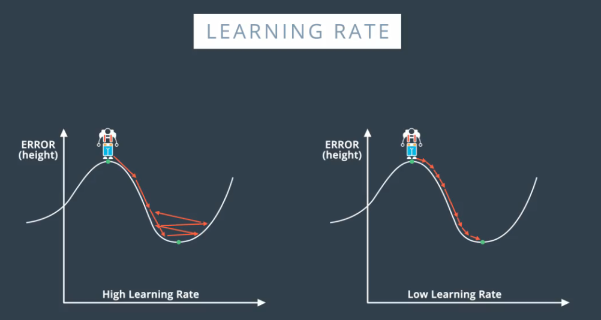

有个好的经验是，如果模型训练效果不好，首先降低学习速率。

最佳学习速率，是在模型越来越靠近最优解时会降低：

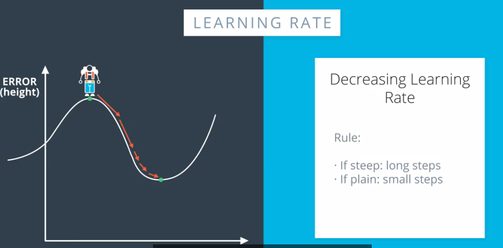


## 随机重新开始

从几个随机的不同地点开始，从所有这些点进行梯度下降，这样就增大了抵达全局最低点，或至少是非常低的局部最低点的概率。

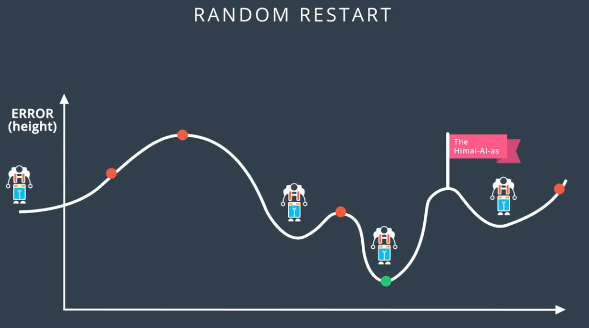

## 动量

在局部最低点可以翻过驼峰找到更低的最低点，

取前几个步长的加权平均值，越靠近，作用越大。

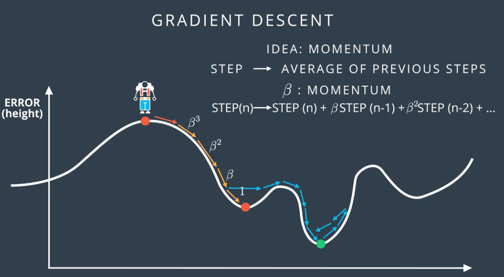

当抵达全局最低点后，依然会超过一点点，但是程度不大，看起来似乎模糊，但是使用动量的算法在实际中似乎运作的很好。

# Keras 优化程序

Keras 中有很多优化程序，建议你访问此[链接](https://keras.io/optimizers/)或[这篇精彩博文](http://sebastianruder.com/optimizing-gradient-descent/index.html#rmsprop)（此链接来自外网，国内网络可能打不开），详细了解这些优化程序。这些优化程序结合使用了上述技巧，以及其他一些技巧。最常见的包括：

**SGD**

这是随机梯度下降。它使用了以下参数：

学习速率。

动量（获取前几步的加权平均值，以便获得动量而不至于陷在局部最低点）。

Nesterov 动量（当最接近解决方案时，它会减缓梯度）。

**Adam**

Adam (Adaptive Moment Estimation) 使用更复杂的指数衰减，不仅仅会考虑平均值（第一个动量），并且会考虑前几步的方差（第二个动量）。

**RMSProp**

RMSProp (RMS 表示均方根误差）通过除以按指数衰减的平方梯度均值来减小学习速率。

# 神经网络的回归

神经网络的分类，最终输出一个0～1的数值：

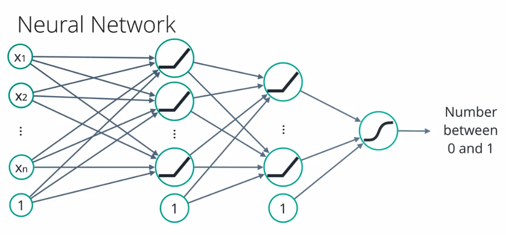

假如希望输出是任意值呢，只需要删除sigmod函数，将各层输出的加权总和传入误差函数，比如均方误差，再反向传播，可以像训练分类一样，训练神经网络。


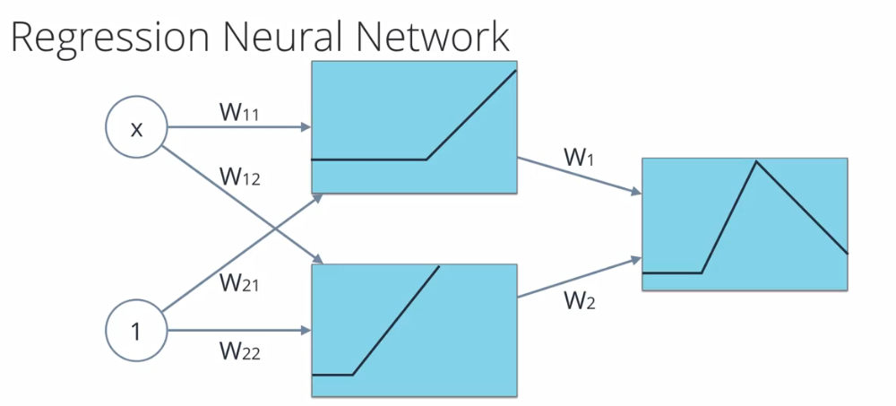

也可以使用其他激活函数，依然用均方误差，反向传播，

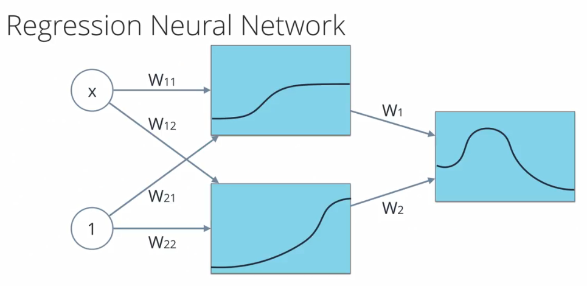

# 神经网络基础知识的视觉和互动指南

我们的内容开发者之一 Jay Alammar 创建了这个神奇的神经网络 “游乐场”，在这里你可以看到很棒的可视化效果，并可以使用参数来解决线性回归问题，然后尝试一些神经网络回归。 预祝学习愉快！

https://jalammar.github.io/visual-interactive-guide-basics-neural-networks/


```python

```
