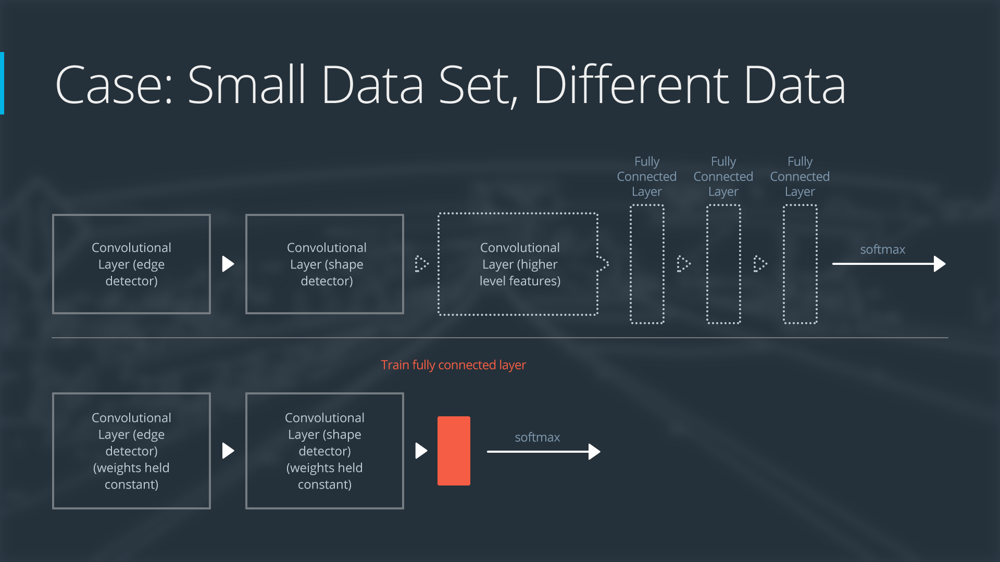

# 1.CNN应用
## 1.WaveNet 模型:

[https://deepmind.com/blog/wavenet-generative-model-raw-audio/](https://deepmind.com/blog/wavenet-generative-model-raw-audio/)

如果你能训练人工智能机器人唱歌，干嘛还训练它聊天？在 2017 年 4 月，研究人员使用 WaveNet 模型的变体生成了歌曲。原始论文和演示可以在此处找到。

http://www.creativeai.net/posts/W2C3baXvf2yJSLbY6/a-neural-parametric-singing-synthesizer

## 2.文本分类 CNN

http://www.wildml.com/2015/12/implementing-a-cnn-for-text-classification-in-tensorflow/

你或许想注册作者的深度[学习简讯！](https://www.getrevue.co/profile/wildml)

# 3.Facebook的创新CNN方法

https://code.facebook.com/posts/1978007565818999/a-novel-approach-to-neural-machine-translation/

该方法专门用于解决语言翻译任务，准确率达到了前沿性水平，并且速度是 RNN 模型的 9 倍。
    
## 4.Atari 游戏

利用 CNN 和强化学习玩 Atari 游戏。你可以下载此论文附带的[代码](https://sites.google.com/a/deepmind.com/dqn/)。

如果你想研究一些（深度强化学习）初学者代码，建议你参阅 Andrej Karpathy 的[帖子。](http://karpathy.github.io/2016/05/31/rl/)

## 5.利用 CNN 玩看图说词游戏！
https://quickdraw.withgoogle.com/#

此外，还可以参阅 [A.I.Experiments](https://aiexperiments.withgoogle.com/) 网站上的所有其他很酷的实现。别忘了 [AutoDraw！](https://www.autodraw.com/)

## 6.详细了解 AlphaGo。

https://deepmind.com/research/alphago/

阅读[这篇文章](https://www.technologyreview.com/s/604273/finding-solace-in-defeat-by-artificial-intelligence/?set=604287)，其中提出了一个问题：如果掌控 Go“需要人类直觉”，那么人性受到挑战是什么感觉？_


## 7.观看这些非常酷的视频，其中的无人机都受到 CNN 的支持。

这是初创企业 [Intelligent Flying Machines (IFM) (Youtube)](https://www.youtube.com/watch?v=AMDiR61f86Y)的访谈。
户外自主导航通常都要借助[全球定位系统](http://www.droneomega.com/gps-drone-navigation-works/) (GPS)，但是下面的演示展示的是由 CNN 提供技术支持的[自主无人机](https://www.youtube.com/watch?v=wSFYOw4VIYY)(Youtube)。

## 8.无人驾驶汽车使用的 CNN 感兴趣

我们在此项目中对德国交通标志数据集中的标志进行分类。

https://github.com/udacity/CarND-Traffic-Sign-Classifier-Project

http://benchmark.ini.rub.de/?section=gtsrb&subsection=dataset

我们在此项目中对街景门牌号数据集中的门牌号进行分类。


https://github.com/udacity/machine-learning/tree/master/projects/digit_recognition

http://ufldl.stanford.edu/housenumbers/

这些系列博客，其中详细讲述了如何训练用 Python 编写的 CNN，以便生成能够玩“侠盗猎车手”的无人驾驶 AI。

https://pythonprogramming.net/game-frames-open-cv-python-plays-gta-v/

## 9.其他应用情形

一些全球最著名的画作被[转换成了三维形式](http://www.businessinsider.com/3d-printed-works-of-art-for-the-blind-2016-1)，以便视力受损人士也能欣赏。虽然这篇文章没有提到是怎么做到的，我们注意到可以使用 CNN 预测[单个图片的深度](https://cs.nyu.edu/~deigen/depth/)。


参阅这篇关于使用 CNN 确定乳腺癌位置的研究[论文](https://research.googleblog.com/2017/03/assisting-pathologists-in-detecting.html)(google research)。

CNN 被用来[拯救濒危物种！](https://blogs.nvidia.com/blog/2016/11/04/saving-endangered-species/?adbsc=social_20170303_70517416)

一款叫做 [FaceApp](http://www.digitaltrends.com/photography/faceapp-neural-net-image-editing/) 的应用使用 CNN 让你在照片中是微笑状态或改变性别。

# 2.图片分类MLP课外资料

参阅首篇建议将 dropout 用作避免过拟合技巧的研究论文。
https://www.cs.toronto.edu/~hinton/absps/JMLRdropout.pdf


这是关于扁平化层级的 Keras 文档。
https://keras.io/layers/core/#flatten

如果你想详细了解激活函数，请访问此网站。
http://cs231n.github.io/neural-networks-1/#actfun

# 损失函数

是用来估量模型中预测值y与真实值Y之间的差异，即不一致程度

如果你想详细了解 Keras 中的完全连接层，请阅读这篇关于密集层的文档。

https://keras.io/layers/core/

你可以通过为 kernel_initializer 和 bias_initializer 参数提供值更改权重的初始化方法。注意默认值分别为 'glorot_uniform' 和 'zeros'。你可以在相应的 Keras 文档中详细了解每种初始化程序的工作方法。

https://keras.io/initializers/


## Keras 中有很多不同的损失函数。

对于这节课来说，我们将仅使用 categorical_crossentropy。

https://keras.io/losses/


参阅 Keras 中可用的优化程序列表。当你编译模型（在记事本的第 7 步）时就会指定优化程序。

https://keras.io/optimizers/

'sgd' : SGD

'rmsprop' : RMSprop

'adagrad' : Adagrad

'adadelta' : Adadelta

'adam' : Adam

'adamax' : Adamax

'nadam' : Nadam

'tfoptimizer' : TFOptimizer


课外资料

在训练过程中，你可以使用很多回调（例如 ModelCheckpoint）来监控你的模型。你可以参阅此处的详情内容。建议你先详细了解 EarlyStopping 回调。

https://keras.io/callbacks/#modelcheckpoint


如果你想查看另一个 ModelCheckpoint 代码示例，请参阅这篇博文。

https://machinelearningmastery.com/check-point-deep-learning-models-keras/

参阅其他分类器的效果。
http://yann.lecun.com/exdb/mnist/

minist数据集的不同分类器效果：

http://yann.lecun.com/exdb/mnist/

# CNN

相对于多层感知机(MLP),卷积神经网络（CNN），

当知道两个输入可能包含相同类型信息时，可以共享它们的权重，并利用这些输入共同训练权重。

统计不变量，即基本上不会随时间或空间改变的事物，无处不在；

对于图像，权重共享的思想引出了卷积网络的研究；

对于一般的文本和序列，则涉及嵌入和循环神经网络。


## 局部连接性


## 参数共享性


对于多层网络输出入


卷积网络本质上就是一个深度网络，但用共享权重的“卷积层”替代了一般的“全连接层”。

总的想法是让它们形成金字塔状，金字塔底部是一个非常大而浅的图片，仅包含RGB三通道，通过卷积操作逐渐挤压空间的维度，同时不断增加深度，使深度信息大体上可以表示出复杂的语义。

在金字塔尖顶端可以放一个分类器，所有空间信息都被压缩成一个表示，仅映射到图片内容的参数被保留。


## 卷积层的stride和pad


# Keras中的卷积层

导入必要的模块：

from keras.layers import Conv2D

创建卷积层

Conv2D(filters, kernel_size, strides, padding, activation='relu', input_shape)

参数

必须传递以下参数：

filters - 过滤器数量。
kernel_size - 指定（方形）卷积窗口的高和宽的数字。

你可能还需要调整其他可选参数：

strides - 卷积 stride。如果不指定任何值，则 strides 设为 1。

padding - 选项包括 'valid' 和 'same'。如果不指定任何值，则 padding 设为 'valid'。

activation - 通常为 'relu'。如果未指定任何值，则不应用任何激活函数。强烈建议你向网络中的每个卷积层添加一个 ReLU 激活函数。

注意：可以将 kernel_size 和 strides 表示为数字或元组。

在模型中将卷积层当做第一层级（出现在输入层之后）时，必须提供另一个 input_shape 参数：

input_shape - 指定输入的高度、宽度和深度（按此顺序）的元组。


你还可以设置很多其他元组参数，以便更改卷积层的行为。要详细了解这些参数，建议参阅官方文档。

https://keras.io/layers/convolutional/


示例 1

假设我要构建一个 CNN，输入层接受的是 200 x 200 像素（对应于高 200、宽 200、深 1 的三维数组）的灰度图片。

然后，假设我希望下一层级是卷积层，具有 16 个过滤器，每个宽和高分别为 2。

在进行卷积操作时，我希望过滤器每次跳转 2 个像素。并且，我不希望过滤器超出图片界限之外；

也就是说，我不想用 0 填充图片。要构建该卷积层，我将使用下面的代码：

Conv2D(filters=16, kernel_size=2, strides=2, activation='relu', input_shape=(200, 200, 1))

示例 2

假设我希望 CNN 的下一层级是卷积层，并将示例 1 中构建的层级作为输入。

假设新层级是 32 个过滤器，每个的宽和高都是 3。

在进行卷积操作时，我希望过滤器每次移动 1 个像素。

我希望卷积层查看上一层级的所有区域，因此不介意过滤器在进行卷积操作时是否超过上一层级的边缘。

然后，要构建此层级，我将使用以下代码：


```python
from keras.layers import Conv2D
Conv2D(filters=32, kernel_size=3, padding='same', activation='relu')

```


    <keras.layers.convolutional.Conv2D at 0x7f7f47aa37b8>


示例 3

如果在线查看代码，经常会在 Keras 中见到以下格式的卷积层：

Conv2D(64, (2,2), activation='relu')

在这种情况下，有 64 个过滤器，每个的大小是 2x2，层级具有 ReLU 激活函数。层级中的其他参数使用默认值，因此卷积的 stride 为 1，填充设为 'valid'。


```python
from keras.models import Sequential
from keras.layers import Conv2D

model = Sequential()
model.add(Conv2D(filters=16, kernel_size=2, strides=2, padding='valid', 
    activation='relu', input_shape=(200, 200, 1)))
model.summary()
```

    Model: "sequential_1"
    _________________________________________________________________
    Layer (type)                 Output Shape              Param #   
    =================================================================
    conv2d_4 (Conv2D)            (None, 100, 100, 16)      80        
    =================================================================
    Total params: 80
    Trainable params: 80
    Non-trainable params: 0
    _________________________________________________________________


# 卷积层中的参数数量

卷积层中的参数数量取决于 filters、kernel_size 和 input_shape 的值。我们定义几个变量：

K - 卷积层中的过滤器数量

F - 卷积过滤器的高度和宽度

D_in - 上一层级的深度

注意：K = filters，F = kernel_size。类似地，D_in 是 input_shape 元组中的最后一个值。

因为每个过滤器有 $F*F*D_in* 个权重，卷积层由 K 个过滤器组成，因此卷积层中的权重总数是 K*F*F*D_in。因为每个过滤器有 1 个偏差项，卷积层有 K 个偏差。因此，卷积层中的参数数量是 K*F*F*D_in + K。

# 卷积层的形状

卷积层的形状取决于 kernel_size、input_shape、padding 和 stride 的值。我们定义几个变量：

K - 卷积层中的过滤器数量

F - 卷积过滤器的高度和宽度

H_in - 上一层级的高度

W_in - 上一层级的宽度

注意：K = filters、F = kernel_size，以及S = stride。类似地，H_in 和 W_in 分别是 input_shape 元组的第一个和第二个值。

卷积层的深度始终为过滤器数量 K。

如果 padding = 'same'，那么卷积层的空间维度如下：

height = ceil(float(H_in) / float(S))

width = ceil(float(W_in) / float(S))

如果 padding = 'valid'，那么卷积层的空间维度如下:

height = ceil(float(H_in - F + 1) / float(S))

width = ceil(float(W_in - F + 1) / float(S))


```python
from keras.models import Sequential
from keras.layers import Conv2D

model = Sequential()
model.add(Conv2D(filters=32, kernel_size=3, strides=2, padding='same', 
    activation='relu', input_shape=(128, 128, 3)))
model.summary()
```

    Model: "sequential_2"
    _________________________________________________________________
    Layer (type)                 Output Shape              Param #   
    =================================================================
    conv2d_5 (Conv2D)            (None, 64, 64, 32)        896       
    =================================================================
    Total params: 896
    Trainable params: 896
    Non-trainable params: 0
    _________________________________________________________________


卷积层是指特征映射堆栈，每个过滤器对应一个特征映射，具有很多不同对象类别的复杂数据集，需要大量过滤器，
每个过滤器负责从图片中查找一种规律，过滤器越多，则堆栈越大，意味着卷积层维度越高，则需要使用更多参数。这样可能会导致过拟合，


因此，需要降低维度，这就是卷积神经网络中的池化层。

## 池化层

最大池化层，将一组特征映射作为输入，单独处理每个特征映射，对每个滑动窗口，取最大值


则输出是一组具有相同数量的特征映射，但每个特征映射的宽和高都减小了；


## 全局平均池化层

采用更极端的降低维度方法，对每个特征映射，取平均值


将三维数组变成了向量


keras其他不同池化层：

https://keras.io/layers/pooling/

论文：

https://arxiv.org/abs/1312.4400

Keras 中的最大池化层

导入必要的模块：

from keras.layers import MaxPooling2D

创建卷积层：

MaxPooling2D(pool_size, strides, padding)

### 参数
你必须包含以下参数：

pool_size - 指定池化窗口高度和宽度的数字。

你可能还需要调整其他可选参数：

strides - 垂直和水平 stride。如果不指定任何值，则 strides 默认为 pool_size。

padding - 选项包括 'valid' 和 'same'。如果不指定任何值，则 padding 设为 'valid'。

注意：可以将 pool_size 和 strides 表示为数字或元组。

官方文档：https://keras.io/layers/pooling/#maxpooling2d


```python
from keras.models import Sequential
from keras.layers import MaxPooling2D

model = Sequential()
model.add(MaxPooling2D(pool_size=2, strides=2, input_shape=(100, 100, 15)))
model.summary()
```

    WARNING:tensorflow:From /home/leon/anaconda3/lib/python3.7/site-packages/keras/backend/tensorflow_backend.py:4070: The name tf.nn.max_pool is deprecated. Please use tf.nn.max_pool2d instead.
    
    Model: "sequential_3"
    _________________________________________________________________
    Layer (type)                 Output Shape              Param #   
    =================================================================
    max_pooling2d_1 (MaxPooling2 (None, 50, 50, 15)        0         
    =================================================================
    Total params: 0
    Trainable params: 0
    Non-trainable params: 0
    _________________________________________________________________


# 设计图片CNN

卷积层，可以检测图片中的区域性规律，池化层在卷积层之后，可以降低数组的维数，加上全连接层，是CNN中常用的网络层。

对于图片的CNN，必须将图片数组作为输入(一般统一大小)，一般使空间维度等于2的幂次方，计算机将任何图片解读为三维数组，输入数组的宽和高始终大于深度。


CNN架构的设计目标，是获取该输入，然后逐渐使其深度大于宽和高。


## 卷积层将用于使穿过卷积层的数组更深，池化层用于减小空间维度，


卷积层设置：


池化层，一般在一个或多个卷基层后面，其经典设置：


这样空间维度变为上一层的一半，这样通过组合使用卷积层和最大池化层，我们就能够获得很深，且空间维度很小的数组。

这种层级序列发现了图片中包含的空间规律，它逐渐获取空间数据，并将数组准换为包含图片内容的表示，所有空间信息最终会丢失，
在原始图片中很容易知道各个像素与其他哪些像素相邻，在最末尾层会发现数组中的条目与哪个项目相邻已经不重要了。


一旦获得不再具有图片中的空间信息的数组，我们就可以扁平化该数组，并将其提供给一个或多个全连接层，判断图片中包含什么对象。


要设计自己的模型，你需要亲自尝试各种架构和不同的超参数，深度学习是一种需要实践操作的领域，所以不要怕麻烦，去实践，并且不要担心违背了规则，
尽量去尝试不同的事物。提出问题，并通过实验来回答你的问题，而不仅仅是思考。


```python
from keras.models import Sequential
from keras.layers import Conv2D, MaxPooling2D, Flatten, Dense

model = Sequential()
model.add(Conv2D(filters=16, kernel_size=2, padding='same', activation='relu', input_shape=(32, 32, 3)))
model.add(MaxPooling2D(pool_size=2))
model.add(Conv2D(filters=32, kernel_size=2, padding='same', activation='relu'))
model.add(MaxPooling2D(pool_size=2))
model.add(Conv2D(filters=64, kernel_size=2, padding='same', activation='relu'))
model.add(MaxPooling2D(pool_size=2))
model.add(Flatten())
model.add(Dense(500, activation='relu'))
model.add(Dense(10, activation='softmax'))

model.summary()
```

    Model: "sequential_4"
    _________________________________________________________________
    Layer (type)                 Output Shape              Param #   
    =================================================================
    conv2d_6 (Conv2D)            (None, 32, 32, 16)        208       
    _________________________________________________________________
    max_pooling2d_2 (MaxPooling2 (None, 16, 16, 16)        0         
    _________________________________________________________________
    conv2d_7 (Conv2D)            (None, 16, 16, 32)        2080      
    _________________________________________________________________
    max_pooling2d_3 (MaxPooling2 (None, 8, 8, 32)          0         
    _________________________________________________________________
    conv2d_8 (Conv2D)            (None, 8, 8, 64)          8256      
    _________________________________________________________________
    max_pooling2d_4 (MaxPooling2 (None, 4, 4, 64)          0         
    _________________________________________________________________
    flatten_1 (Flatten)          (None, 1024)              0         
    _________________________________________________________________
    dense_1 (Dense)              (None, 500)               512500    
    _________________________________________________________________
    dense_2 (Dense)              (None, 10)                5010      
    =================================================================
    Total params: 528,054
    Trainable params: 528,054
    Non-trainable params: 0
    _________________________________________________________________


该网络以三个卷积层（后面跟着最大池化层）序列开始。前 6 个层级旨在将图片像素数组输入转换为所有空间信息都丢失、仅保留图片内容信息的数组 。然后在 CNN 的第七个层级将该数组扁平化为向量。后面跟着两个密集层，旨在进一步说明图片中的内容。最后一层针对数据集中的每个对象类别都有一个条目，并具有一个 softmax 激活函数，使其返回概率。

注意事项

始终向 CNN 中的 Conv2D 层添加 ReLU 激活函数。但是网络的最后层级除外，密集层也应该具有 ReLU 激活函数。

在构建分类网络时，网络中的最后层级应该是具有 softmax 激活函数的密集层。最后层级的节点数量应该等于数据集中的类别总数。

要开心！如果你觉得有点泄气，建议参阅 Andrej Karpathy 的 tumblr（来自外网，可能打不开），其中包含了用户提交的损失函数，对应的是本身有问题的模型。损失函数在训练期间应该是减小的，但是这些图表显示的却是非常不同的行为 :)。
https://lossfunctions.tumblr.com/


课外资料

这是用于在 Keras 中指定神经网络（包括 CNN）的备忘单。

https://s3.amazonaws.com/assets.datacamp.com/blog_assets/Keras_Cheat_Sheet_Python.pdf


参阅 CIFAR-10 竞赛的获胜架构！

http://blog.kaggle.com/2015/01/02/cifar-10-competition-winners-interviews-with-dr-ben-graham-phil-culliton-zygmunt-zajac/


```python

```


```python
# create and configure augmented image generator

datagen = ImageDataGenerator(width_shift_range=0.1, #randomly shfit images horizontally ,10% oftaotal width
                            height_shift_range=0.1, #randomly shfit images vertically , 10% of  total height
                            horizontal_flip=True)   #randomly flip images horizontally

# fit augmented image generator on data

datagen.fit(x_train)
```


    ---------------------------------------------------------------------------

    NameError                                 Traceback (most recent call last)

    <ipython-input-11-e7f60908369d> in <module>
          7 # fit augmented image generator on data
          8 
    ----> 9 datagen.fit(x_train)
    

    NameError: name 'x_train' is not defined


```python
from keras.models import Sequential
from keras.layers import Conv2D, MaxPooling2D, Flatten, Dense

model = Sequential()
model.add(Conv2D(filters=16, kernel_size=2, padding='same', activation='relu', input_shape=(32, 32, 3)))
model.add(MaxPooling2D(pool_size=2))
model.add(Conv2D(filters=32, kernel_size=2, padding='same', activation='relu'))
model.add(MaxPooling2D(pool_size=2))
model.add(Conv2D(filters=64, kernel_size=2, padding='same', activation='relu'))
model.add(MaxPooling2D(pool_size=2))
model.add(Flatten())
model.add(Dense(500, activation='relu'))
model.add(Dense(10, activation='softmax'))

#model.summary()
```


from keras.callbacks import ModelCheckpoint

batch_size = 12
epochs = 100
#train the model
checkpointer = ModelCheckpoint(filepath='aug_model.weights.best.hdf5',verbose=1,save_best_only=True)

model.fit_generator(datagen.flow(x_train, y_train,batch_size=batch_size),
                   steps_per_epoch = x_train.shape[0]//batch_size,
                   epochs=epochs, verbose=2, callbacks=[checkpointer],
                   validation_data=(x_valid,y_valid))

model.load_weights('aug_model.weights.best.hdf5')
score = model.evaluate(x_test, y_test,verbose=0)

关于 steps_per_epoch 的注意事项

fit_generator 具有很多参数，包括

steps_per_epoch = x_train.shape[0] / batch_size

其中 x_train.shape[0] 对应的是训练数据集 x_train 中的独特样本数量。通过将 steps_per_epoch 设为此值，我们确保模型在每个 epoch 中看到 x_train.shape[0] 个增强图片。

课外资料

阅读这篇对 MNIST 数据集进行可视化的精彩博文。

http://machinelearningmastery.com/image-augmentation-deep-learning-keras/

参阅此详细实现，了解如何使用增强功能提高 Kaggle 数据集的效果。

https://blog.keras.io/building-powerful-image-classification-models-using-very-little-data.html

阅读关于 ImageDataGenerator 类的 Keras 文档。

https://keras.io/preprocessing/image/

# 突破性的cnn架构

课外资料

AlexNet，2012年多伦多大学团队完成，采用Relu激活函数和Dropout来避免过拟合。

参阅 **AlexNet** 论文！

http://papers.nips.cc/paper/4824-imagenet-classification-with-deep-convolutional-neural-networks.pdf


VGG,2014年，牛津大学视觉集合小组开发，包括VGG16,VGG19两个版本


在此处详细了解 **VGGNet**。
https://arxiv.org/pdf/1409.1556.pdf


FesNet，2015微软开发，在ImageNet数据库的图片分类方面取得了惊人的效果；


此处是 **ResNet** 论文。
https://arxiv.org/pdf/1512.03385v1.pdf

这是用于访问一些著名 CNN 架构的 Keras 文档。
https://keras.io/applications/

阅读这一关于梯度消失问题的详细处理方案。
http://neuralnetworksanddeeplearning.com/chap5.html

这是包含不同 CNN 架构的基准的 GitHub 资源库。
https://github.com/jcjohnson/cnn-benchmarks

访问 ImageNet Large Scale Visual Recognition Competition (ILSVRC) 网站。
http://www.image-net.org/challenges/LSVRC/

# 可视化CNN

（非常棒的）课外资料 ！
注：由于以下部分链接来自于外网，国内网络可能打不开

如果你想详细了解如何解读 CNN（尤其是卷积层），建议查看以下资料：

1.这是摘自斯坦福大学的 CS231n 课程中的一个a 章节，其中对 CNN 学习的内容进行了可视化。
http://cs231n.github.io/understanding-cnn/
    
2.参阅这个关于很酷的 OpenFrameworks 应用的演示，该应用可以根据用户提供的视频实时可视化 CNN！

http://openframeworks.cc/

https://aiexperiments.withgoogle.com/what-neural-nets-see

3.这是另一个 CNN 可视化工具的[演示](https://www.youtube.com/watch?v=AgkfIQ4IGaM&t=78s)。如果你想详细了解这些可视化图表是如何制作的，请观看此[视频](https://www.youtube.com/watch?v=ghEmQSxT6tw&t=5s)。

4.这是另一个可与 Keras 和 Tensorflow 中的 CNN 无缝合作的可视化工具。

https://medium.com/merantix/picasso-a-free-open-source-visualizer-for-cnns-d8ed3a35cfc5

5.阅读这篇可视化 CNN 如何看待这个世界的 [Keras 博文](https://blog.keras.io/how-convolutional-neural-networks-see-the-world.html)。在此博文中，你会找到 Deep Dreams 的简单介绍，以及在 Keras 中自己编写 Deep Dreams 的代码。阅读了这篇博文后：

再观看这个利用 Deep Dreams 的[音乐视频](https://www.youtube.com/watch?v=XatXy6ZhKZw)（注意 3:15-3:40 部分）！

使用[这个网站](https://deepdreamgenerator.com/)创建自己的 Deep Dreams（不用编写任何代码！）。

6.如果你想详细了解 CNN 的解释

这篇文章详细讲解了在现实生活中使用深度学习模型（暂时无法解释）的一些危险性。

https://openai.com/blog/adversarial-example-research/

这一领域有很多热点研究。这些作者最近朝着正确的方向迈出了一步。

https://arxiv.org/abs/1611.03530

# 迁移学习

迁移学习是指对提前训练过的神经网络进行调整，以用于新的不同数据集。

### 取决于以下两个条件：

1.新数据集的大小，以及

2.新数据集与原始数据集的相似程度


使用迁移学习的方法将各不相同。有以下四大主要情形：

新数据集很小，新数据与原始数据相似

新数据集很小，新数据不同于原始训练数据

新数据集很大，新数据与原始训练数据相似

新数据集很大，新数据不同于原始训练数据


大型数据集可能具有 100 万张图片。小型数据集可能有 2000 张图片。大型数据集与小型数据集之间的界限比较主观。对小型数据集使用迁移学习需要考虑过拟合现象。

狗的图片和狼的图片可以视为相似的图片；这些图片具有共同的特征。鲜花图片数据集不同于狗类图片数据集。

四个迁移学习情形均具有自己的方法。

演示网络

为了解释每个情形的工作原理，我们将以一个普通的预先训练过的卷积神经网络开始，并解释如何针对每种情形调整该网络。我们的示例网络包含三个卷积层和三个完全连接层：


下面是卷积神经网络的作用一般概述：

第一层级将检测图片中的边缘

第二层级将检测形状

第三个卷积层将检测更高级的特征

每个迁移学习情形将以不同的方式使用预先训练过的神经网络。

## 情形 1：小数据集，相似数据


如果新数据集很小，并且与原始训练数据相似：

删除神经网络的最后层级

添加一个新的完全连接层，与新数据集中的类别数量相匹配

随机化设置新的完全连接层的权重；冻结预先训练过的网络中的所有权重

训练该网络以更新新连接层的权重

为了避免小数据集出现过拟合现象，原始网络的权重将保持不变，而不是重新训练这些权重。

因为数据集比较相似，每个数据集的图片将具有相似的更高级别特征。因此，大部分或所有预先训练过的神经网络层级已经包含关于新数据集的相关信息，应该保持不变。

以下是如何可视化此方法的方式：


## 情形 2：小型数据集、不同的数据


如果新数据集很小，并且与原始训练数据不同：

将靠近网络开头的大部分预先训练过的层级删掉

向剩下的预先训练过的层级添加新的完全连接层，并与新数据集的类别数量相匹配

随机化设置新的完全连接层的权重；冻结预先训练过的网络中的所有权重

训练该网络以更新新连接层的权重

因为数据集很小，因此依然需要注意过拟合问题。要解决过拟合问题，原始神经网络的权重应该保持不变，就像第一种情况那样。

但是原始训练集和新的数据集并不具有相同的更高级特征。在这种情况下，新的网络仅使用包含更低级特征的层级。

以下是如何可视化此方法的方式：




## 情形 3：大型数据集、相似数据


如果新数据集比较大型，并且与原始训练数据相似：

删掉最后的完全连接层，并替换成与新数据集中的类别数量相匹配的层级

随机地初始化新的完全连接层的权重

使用预先训练过的权重初始化剩下的权重

重新训练整个神经网络

训练大型数据集时，过拟合问题不严重；因此，你可以重新训练所有权重。

因为原始训练集和新的数据集具有相同的更高级特征，因此使用整个神经网络。

以下是如何可视化此方法的方式：


## 情形 4：大型数据集、不同的数据


如果新数据集很大型，并且与原始训练数据不同：

删掉最后的完全连接层，并替换成与新数据集中的类别数量相匹配的层级

使用随机初始化的权重重新训练网络

或者，你可以采用和“大型相似数据”情形的同一策略

虽然数据集与训练数据不同，但是利用预先训练过的网络中的权重进行初始化可能使训练速度更快。因此这种情形与大型相似数据集这一情形完全相同。

如果使用预先训练过的网络作为起点不能生成成功的模型，另一种选择是随机地初始化卷积神经网络权重，并从头训练网络。

以下是如何可视化此方法的方式：


课外资料

参阅这篇 研究论文，该论文系统地分析了预先训练过的 CNN 中的特征的可迁移性。

https://arxiv.org/pdf/1411.1792.pdf

阅读这篇详细介绍 Sebastian Thrun 的[癌症检测 CNN 的《自然》论文！](http://www.nature.com/articles/nature21056.epdf?referrer_access_token=_snzJ5POVSgpHutcNN4lEtRgN0jAjWel9jnR3ZoTv0NXpMHRAJy8Qn10ys2O4tuP9jVts1q2g1KBbk3Pd3AelZ36FalmvJLxw1ypYW0UxU7iShiMp86DmQ5Sh3wOBhXDm9idRXzicpVoBBhnUsXHzVUdYCPiVV0Slqf-Q25Ntb1SX_HAv3aFVSRgPbogozIHYQE3zSkyIghcAppAjrIkw1HtSwMvZ1PXrt6fVYXt-dvwXKEtdCN8qEHg0vbfl4_m&tracking_referrer=edition.cnn.com)


# Keras中的迁移学习

其他课外资料

这是提议将 GAP 层级用于对象定位的首篇研究论文。

http://cnnlocalization.csail.mit.edu/Zhou_Learning_Deep_Features_CVPR_2016_paper.pdf

参阅这个使用 CNN 进行对象定位的资源库。

https://github.com/alexisbcook/ResNetCAM-keras

观看这个关于使用 CNN 进行对象定位的视频演示(Youtube链接，国内网络可能打不开)。

https://www.youtube.com/watch?v=fZvOy0VXWAI

参阅这个使用可视化机器更好地理解瓶颈特征的资源库。

https://github.com/alexisbcook/keras_transfer_cifar10


```python

```
