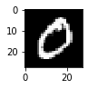
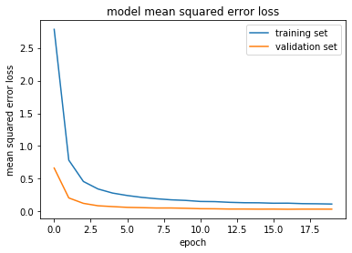
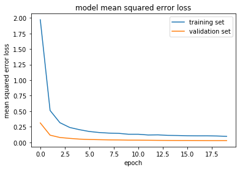

https://keras-cn.readthedocs.io/en/latest/other/application/


```python
for layer in resnet_flower_model.layers[:10]:
    layer.trainable = False
```


    ---------------------------------------------------------------------------

    NameError                                 Traceback (most recent call last)

    <ipython-input-300-47c58ed35f28> in <module>
    ----> 1 for layer in resnet_flower_model.layers[:10]:
          2     layer.trainable = False


    NameError: name 'resnet_flower_model' is not defined


```python
!pip install pydot
```

    Requirement already satisfied: pydot in /home/leon/anaconda3/lib/python3.7/site-packages (1.4.1)
    Requirement already satisfied: pyparsing>=2.1.4 in /home/leon/anaconda3/lib/python3.7/site-packages (from pydot) (2.4.5)


```python
from keras.datasets import mnist
from keras.preprocessing.image import ImageDataGenerator
from matplotlib import pyplot
from keras import backend as K

#K.set_image_dim_ordering('th')


(train_data, train_label), (test_data, test_label) = mnist.load_data()
print(train_data.shape)
print(test_data.shape)
train_data = train_data.reshape(train_data.shape[0], 28, 28,1)
train_data = train_data.astype('float32')

from keras.utils import to_categorical
train_label = to_categorical(train_label)

# 创建一个 3*3的九宫格，以显示图片
pyplot.subplot(330 + 1)
pyplot.imshow(train_data[1].reshape(28, 28), cmap=pyplot.get_cmap('gray'))
pyplot.show()

```

    (60000, 28, 28)
    (10000, 28, 28)





```python
print(test_data.shape)
test_data = test_data.reshape(test_data.shape[0], 28, 28,1)
test_data = test_data.astype('float32')
test_label = to_categorical(test_label)
print(test_data.shape)
```

    (10000, 28, 28)
    (10000, 28, 28, 1)


```python
print(train_data.shape)
print(train_label.shape)
print(len(train_label))

print(test_data.shape)
print(test_label.shape)
print(len(test_label))
```

    (60000, 28, 28, 1)
    (60000, 10)
    60000
    (10000, 28, 28, 1)
    (10000, 10)
    10000


```python
# 随机数种子，重复性设置
np.random.seed(1689)
 
# 网络结构和训练的参数
EPOCH = 20
BATCH_SIZE = 128
VERBOSE = 1
NB_CLASSES = 10
OPTIMIZER = 'rmsprop'
VALIDATION_SPLIT = 0.2
```


```python
from keras.layers import Conv2D, MaxPooling2D, GlobalAveragePooling2D
from keras.layers import Dropout, Flatten, Dense
from keras.models import Sequential

model = Sequential()

### TODO: 定义你的网络架构

model.add(Conv2D(filters=32, kernel_size=3, padding='valid', activation='relu', input_shape=(28, 28,1)))
#model.add(Conv2D(32, (3,3), input_shape=(160, 160, 3), activation="relu"))
model.add(MaxPooling2D(pool_size=2))
#model.add(MaxPooling2D(pool_size=(2,2)))
model.add(Dropout(0.5))

model.add(Conv2D(filters=64, kernel_size=3, padding='valid', activation='relu'))
model.add(MaxPooling2D(pool_size=2))

model.add(Dropout(0.5))
model.add(Conv2D(filters=128, kernel_size=3, padding='valid', activation='relu'))

model.add(GlobalAveragePooling2D())

model.add(Dropout(0.5))

model.add(Dense(NB_CLASSES, activation='softmax'))

model.summary()
```

    Model: "sequential_22"
    _________________________________________________________________
    Layer (type)                 Output Shape              Param #   
    =================================================================
    conv2d_58 (Conv2D)           (None, 26, 26, 32)        320       
    _________________________________________________________________
    max_pooling2d_37 (MaxPooling (None, 13, 13, 32)        0         
    _________________________________________________________________
    dropout_55 (Dropout)         (None, 13, 13, 32)        0         
    _________________________________________________________________
    conv2d_59 (Conv2D)           (None, 11, 11, 64)        18496     
    _________________________________________________________________
    max_pooling2d_38 (MaxPooling (None, 5, 5, 64)          0         
    _________________________________________________________________
    dropout_56 (Dropout)         (None, 5, 5, 64)          0         
    _________________________________________________________________
    conv2d_60 (Conv2D)           (None, 3, 3, 128)         73856     
    _________________________________________________________________
    global_average_pooling2d_19  (None, 128)               0         
    _________________________________________________________________
    dropout_57 (Dropout)         (None, 128)               0         
    _________________________________________________________________
    dense_19 (Dense)             (None, 10)                1290      
    =================================================================
    Total params: 93,962
    Trainable params: 93,962
    Non-trainable params: 0
    _________________________________________________________________


```python
model.compile(loss='categorical_crossentropy', optimizer='adam', metrics=['acc'])
history = model.fit(train_data, train_label, batch_size=BATCH_SIZE, epochs=EPOCH, verbose=VERBOSE,validation_split=VALIDATION_SPLIT)
```

    Train on 48000 samples, validate on 12000 samples
    Epoch 1/20
    48000/48000 [==============================] - 10s 208us/step - loss: 2.7828 - acc: 0.3195 - val_loss: 0.6640 - val_acc: 0.8288
    Epoch 2/20
    48000/48000 [==============================] - 10s 198us/step - loss: 0.7846 - acc: 0.7399 - val_loss: 0.2075 - val_acc: 0.9477
    Epoch 3/20
    48000/48000 [==============================] - 9s 198us/step - loss: 0.4588 - acc: 0.8555 - val_loss: 0.1247 - val_acc: 0.9689
    Epoch 4/20
    48000/48000 [==============================] - 9s 198us/step - loss: 0.3443 - acc: 0.8939 - val_loss: 0.0878 - val_acc: 0.9758
    Epoch 5/20
    48000/48000 [==============================] - 9s 198us/step - loss: 0.2817 - acc: 0.9135 - val_loss: 0.0750 - val_acc: 0.9800
    Epoch 6/20
    48000/48000 [==============================] - 9s 198us/step - loss: 0.2445 - acc: 0.9257 - val_loss: 0.0634 - val_acc: 0.9832
    Epoch 7/20
    48000/48000 [==============================] - 9s 198us/step - loss: 0.2159 - acc: 0.9351 - val_loss: 0.0589 - val_acc: 0.9832
    Epoch 8/20
    48000/48000 [==============================] - 9s 198us/step - loss: 0.1949 - acc: 0.9408 - val_loss: 0.0536 - val_acc: 0.9852
    Epoch 9/20
    48000/48000 [==============================] - 9s 197us/step - loss: 0.1787 - acc: 0.9466 - val_loss: 0.0538 - val_acc: 0.9849
    Epoch 10/20
    48000/48000 [==============================] - 9s 198us/step - loss: 0.1696 - acc: 0.9492 - val_loss: 0.0495 - val_acc: 0.9856
    Epoch 11/20
    48000/48000 [==============================] - 9s 198us/step - loss: 0.1536 - acc: 0.9526 - val_loss: 0.0430 - val_acc: 0.9872
    Epoch 12/20
    48000/48000 [==============================] - 9s 198us/step - loss: 0.1510 - acc: 0.9538 - val_loss: 0.0416 - val_acc: 0.9872
    Epoch 13/20
    48000/48000 [==============================] - 9s 198us/step - loss: 0.1403 - acc: 0.9557 - val_loss: 0.0377 - val_acc: 0.9893
    Epoch 14/20
    48000/48000 [==============================] - 9s 197us/step - loss: 0.1344 - acc: 0.9594 - val_loss: 0.0378 - val_acc: 0.9902
    Epoch 15/20
    48000/48000 [==============================] - 9s 198us/step - loss: 0.1332 - acc: 0.9609 - val_loss: 0.0362 - val_acc: 0.9904
    Epoch 16/20
    48000/48000 [==============================] - 9s 198us/step - loss: 0.1266 - acc: 0.9620 - val_loss: 0.0370 - val_acc: 0.9896
    Epoch 17/20
    48000/48000 [==============================] - 10s 198us/step - loss: 0.1274 - acc: 0.9617 - val_loss: 0.0347 - val_acc: 0.9906
    Epoch 18/20
    48000/48000 [==============================] - 10s 198us/step - loss: 0.1202 - acc: 0.9635 - val_loss: 0.0366 - val_acc: 0.9892
    Epoch 19/20
    48000/48000 [==============================] - 10s 198us/step - loss: 0.1181 - acc: 0.9647 - val_loss: 0.0365 - val_acc: 0.9895
    Epoch 20/20
    48000/48000 [==============================] - 9s 198us/step - loss: 0.1141 - acc: 0.9655 - val_loss: 0.0360 - val_acc: 0.9898


```python
# 评估模型
score = model.evaluate(test_data, test_label, verbose=1)
print('Test score:', score[0])
print('Test accuracy:', score[1])

```

    10000/10000 [==============================] - 1s 78us/step
    Test score: 0.028671354174159933
    Test accuracy: 0.991100013256073


```python
from keras.models import Model
import matplotlib.pyplot as plt
```


```python
### print the keys contained in the history object
print(history.history.keys())

### plot the training and validation loss for each epoch
plt.plot(history.history['loss'])
plt.plot(history.history['val_loss'])
plt.title('model mean squared error loss')
plt.ylabel('mean squared error loss')
plt.xlabel('epoch')
plt.legend(['training set', 'validation set'], loc='upper right')
plt.show()
```

    dict_keys(['val_loss', 'val_acc', 'loss', 'acc'])





# 1 完整保存模型所有状态

可以使用model.save(filepath)将Keras模型和权重保存在一个HDF5文件中，该文件将包含：

模型的结构，以便重构该模型

模型的权重

训练配置（损失函数，优化器等）

优化器的状态，以便于从上次训练中断的地方开始

使用keras.models.load_model(filepath)来重新实例化你的模型，如果文件中存储了训练配置的话，该函数还会同时完成模型的编译

**优势**：不仅保存了模型结构和参数，也保存了训练配置等信息，可以方便从上次训练中断的地方继续优化；

**劣势**：占用空间太大


```python
model_all = 'my_model_all.h5'
model.save(model_all)
```


```python
# 加载整个模型
model_01 = load_model(model_all)
 
# 也可以继续训练模型
#history_01 = model_01.fit(train_data, train_label, batch_size=BATCH_SIZE, epochs=EPOCH, verbose=VERBOSE, validation_split=VALIDATION_SPLIT)
```


```python
# 评估模型
score = model_01.evaluate(test_data, test_label, verbose=1)
print('Test score:', score[0])
print('Test accuracy:', score[1])
```

    10000/10000 [==============================] - 1s 86us/step
    Test score: 0.028671354174159933
    Test accuracy: 0.991100013256073


# 2.分别保存/加载模型结构和权重

**优势**:节省硬盘空间，方便同步和协作

**劣势**:丢失了训练的一些配置信息 


```python
model_save_weights = "my_model_weights.h5"
# 保存模型权重
model.save_weights(model_save_weights)
```


```python
# 加载模型权重,原model加载参数可以继续训练
model.load_weights(model_save_weights)

score = model.evaluate(test_data, test_label, verbose=1)
print('Test score:', score[0])
print('Test accuracy:', score[1])
```

    10000/10000 [==============================] - 1s 65us/step
    Test score: 0.028671354174159933
    Test accuracy: 0.991100013256073


### 方法1：保存为json


```python
json_string = model.to_json()
open('my_model_arthitecture.json', 'w').write(json_string)   #重命名
```


    3503


```python
#从json中读出数据
from keras.models import model_from_json
model_02 = model_from_json(json_string)
```


```python
# 加载模型权重,原model加载参数可以继续训练
model_02.load_weights(model_save_weights)
```


```python
model_02.compile(optimizer='rmsprop',loss='categorical_crossentropy', metrics=['accuracy'])

#history_02 = model_02.fit(train_data, train_label, batch_size=BATCH_SIZE, epochs=EPOCH, verbose=VERBOSE, validation_split=VALIDATION_SPLIT)
```


```python
score = model_02.evaluate(test_data, test_label, verbose=1)
print('Test score:', score[0])
print('Test accuracy:', score[1])
```

    10000/10000 [==============================] - 1s 86us/step
    Test score: 0.028671354174159933
    Test accuracy: 0.991100013256073


## 方法2：保存为yaml


```python
yaml_string = model.to_yaml()
open('my_model_arthitecture.yaml', 'w').write(yaml_string)  #重命名
```


    4112


```python
#从json中读出数据
from keras.models import model_from_yaml
model_03 = model_from_yaml(yaml_string)

# 加载模型权重,原model加载参数可以继续训练
model_03.load_weights(model_save_weights)
```


```python
model_03.compile(optimizer='rmsprop',loss='categorical_crossentropy', metrics=['accuracy'])

#history_03 = model_03.fit(train_data, train_label, batch_size=BATCH_SIZE, epochs=EPOCH, verbose=VERBOSE, validation_split=VALIDATION_SPLIT)
```


```python
score = model_03.evaluate(test_data, test_label, verbose=1)
print('Test score:', score[0])
print('Test accuracy:', score[1])
```

    10000/10000 [==============================] - 1s 87us/step
    Test score: 0.028671354174159933
    Test accuracy: 0.991100013256073


这几种保存模型的联系与区别

|方法 	        |保存模型结构	|保存模型权重	|是否能进行模型预测|
|--------------------|-------------|-------------|------------------|
|model.save()      |是	      |是        |是|
|model.save_weights()|否	       |是	      |是|
|model.to_json()    |是	      |否	      |加载权重，编译后能进行正常预测|
model.to_yaml()     |是        |	否       |加载权重，编译后能进行正常预测|

ps:重新加载模型后，可以重新训练；或者加载模型和权重后，在上一次权重基础上继续训练；

### compile做什么？

compile定义了loss function损失函数、optimizer优化器和metrics度量。它与权重无关，也就是说compile并不会影响权重，不会影响之前训练的问题。


```python
!pip install pydot-ng 
```

    Requirement already satisfied: pydot-ng in /home/leon/anaconda3/lib/python3.7/site-packages (2.0.0)
    Requirement already satisfied: pyparsing>=2.0.1 in /home/leon/anaconda3/lib/python3.7/site-packages (from pydot-ng) (2.4.5)


# 保存最佳模型


```python
from keras.callbacks import ModelCheckpoint
```

keras.callbacks.ModelCheckpoint(filepath, monitor='val_loss', verbose=0, save_best_only=False, save_weights_only=False, mode='auto', period=1)

在每个训练期之后保存模型。

filepath 可以包括命名格式选项，可以由 epoch 的值和 logs 的键（由 on_epoch_end 参数传递）来填充。

例如：如果 filepath 是 weights.{epoch:02d}-{val_loss:.2f}.hdf5， 那么模型被保存的的文件名就会有训练轮数和验证损失。

filepath: 字符串，保存模型的路径。

monitor: 被监测的数据。

verbose: 详细信息模式，0 或者 1 。

save_best_only: 如果 save_best_only=True， 只保存在验证集上性能最好的模型。

mode: {auto, min, max} 的其中之一。 如果 save_best_only=True，那么是否覆盖保存文件的决定就取决于被监测数据的最大或者最小值。 

对于 val_acc，模式就会是 max，

而对于 val_loss，模式就需要是 min，等等。 

在 auto 模式中，方向会自动从被监测的数据的名字中判断出来。

save_weights_only: 如果 True，那么只有模型的权重会被保存 (model.save_weights(filepath))， 否则的话，整个模型会被保存 (model.save(filepath))。

period: 每个CheckPoint之间的间隔（训练轮数）。


```python
#from keras.callbacks import Tensorboad
from keras.callbacks import ModelCheckpoint

filepath='weights.best.hdf5'

checkpoint = ModelCheckpoint(filepath, 
                             monitor='val_acc', 
                             verbose=1, 
                             save_best_only=True, 
                             mode='max',
                             period=1)

callbacks_list = [checkpoint]

model.compile(optimizer='rmsprop',loss='categorical_crossentropy', metrics=['acc'])

```


```python
history_04 = model.fit(train_data, train_label,validation_data=(test_data, test_label), batch_size=BATCH_SIZE, epochs=EPOCH,validation_split=VALIDATION_SPLIT,callbacks=callbacks_list)
```

    Train on 60000 samples, validate on 10000 samples
    Epoch 1/20
    60000/60000 [==============================] - 12s 204us/step - loss: 1.3368 - acc: 0.6510 - val_loss: 0.1234 - val_acc: 0.9631
    
    Epoch 00001: val_acc improved from -inf to 0.96310, saving model to weights.best.hdf5
    Epoch 2/20
    60000/60000 [==============================] - 12s 195us/step - loss: 0.2708 - acc: 0.9161 - val_loss: 0.0583 - val_acc: 0.9808
    
    Epoch 00002: val_acc improved from 0.96310 to 0.98080, saving model to weights.best.hdf5
    Epoch 3/20
    60000/60000 [==============================] - 12s 195us/step - loss: 0.1952 - acc: 0.9413 - val_loss: 0.0549 - val_acc: 0.9828
    
    Epoch 00003: val_acc improved from 0.98080 to 0.98280, saving model to weights.best.hdf5
    Epoch 4/20
    60000/60000 [==============================] - 12s 195us/step - loss: 0.1671 - acc: 0.9511 - val_loss: 0.0403 - val_acc: 0.9868
    
    Epoch 00004: val_acc improved from 0.98280 to 0.98680, saving model to weights.best.hdf5
    Epoch 5/20
    60000/60000 [==============================] - 12s 195us/step - loss: 0.1490 - acc: 0.9550 - val_loss: 0.0379 - val_acc: 0.9886
    
    Epoch 00005: val_acc improved from 0.98680 to 0.98860, saving model to weights.best.hdf5
    Epoch 6/20
    60000/60000 [==============================] - 12s 195us/step - loss: 0.1370 - acc: 0.9592 - val_loss: 0.0348 - val_acc: 0.9897
    
    Epoch 00006: val_acc improved from 0.98860 to 0.98970, saving model to weights.best.hdf5
    Epoch 7/20
    60000/60000 [==============================] - 12s 195us/step - loss: 0.1299 - acc: 0.9625 - val_loss: 0.0340 - val_acc: 0.9892
    
    Epoch 00007: val_acc did not improve from 0.98970
    Epoch 8/20
    60000/60000 [==============================] - 12s 195us/step - loss: 0.1243 - acc: 0.9635 - val_loss: 0.0357 - val_acc: 0.9897
    
    Epoch 00008: val_acc did not improve from 0.98970
    Epoch 9/20
    60000/60000 [==============================] - 12s 195us/step - loss: 0.1214 - acc: 0.9644 - val_loss: 0.0315 - val_acc: 0.9901
    
    Epoch 00009: val_acc improved from 0.98970 to 0.99010, saving model to weights.best.hdf5
    Epoch 10/20
    60000/60000 [==============================] - 12s 195us/step - loss: 0.1175 - acc: 0.9645 - val_loss: 0.0309 - val_acc: 0.9906
    
    Epoch 00010: val_acc improved from 0.99010 to 0.99060, saving model to weights.best.hdf5
    Epoch 11/20
    60000/60000 [==============================] - 12s 195us/step - loss: 0.1169 - acc: 0.9646 - val_loss: 0.0339 - val_acc: 0.9902
    
    Epoch 00011: val_acc did not improve from 0.99060
    Epoch 12/20
    60000/60000 [==============================] - 12s 195us/step - loss: 0.1156 - acc: 0.9663 - val_loss: 0.0338 - val_acc: 0.9894
    
    Epoch 00012: val_acc did not improve from 0.99060
    Epoch 13/20
    60000/60000 [==============================] - 12s 194us/step - loss: 0.1125 - acc: 0.9665 - val_loss: 0.0334 - val_acc: 0.9901
    
    Epoch 00013: val_acc did not improve from 0.99060
    Epoch 14/20
    60000/60000 [==============================] - 12s 195us/step - loss: 0.1121 - acc: 0.9678 - val_loss: 0.0298 - val_acc: 0.9911
    
    Epoch 00014: val_acc improved from 0.99060 to 0.99110, saving model to weights.best.hdf5
    Epoch 15/20
    60000/60000 [==============================] - 12s 194us/step - loss: 0.1087 - acc: 0.9682 - val_loss: 0.0316 - val_acc: 0.9907
    
    Epoch 00015: val_acc did not improve from 0.99110
    Epoch 16/20
    60000/60000 [==============================] - 12s 195us/step - loss: 0.1070 - acc: 0.9692 - val_loss: 0.0301 - val_acc: 0.9901
    
    Epoch 00016: val_acc did not improve from 0.99110
    Epoch 17/20
    60000/60000 [==============================] - 12s 194us/step - loss: 0.1090 - acc: 0.9677 - val_loss: 0.0295 - val_acc: 0.9908
    
    Epoch 00017: val_acc did not improve from 0.99110
    Epoch 18/20
    60000/60000 [==============================] - 12s 195us/step - loss: 0.1101 - acc: 0.9677 - val_loss: 0.0286 - val_acc: 0.9916
    
    Epoch 00018: val_acc improved from 0.99110 to 0.99160, saving model to weights.best.hdf5
    Epoch 19/20
    60000/60000 [==============================] - 12s 195us/step - loss: 0.1075 - acc: 0.9693 - val_loss: 0.0313 - val_acc: 0.9896
    
    Epoch 00019: val_acc did not improve from 0.99160
    Epoch 20/20
    60000/60000 [==============================] - 12s 195us/step - loss: 0.1064 - acc: 0.9693 - val_loss: 0.0313 - val_acc: 0.9913
    
    Epoch 00020: val_acc did not improve from 0.99160


```python
### print the keys contained in the history object
print(history_04.history.keys())

### plot the training and validation loss for each epoch
plt.plot(history_05.history['loss'])
plt.plot(history_05.history['val_loss'])
plt.title('model mean squared error loss')
plt.ylabel('mean squared error loss')
plt.xlabel('epoch')
plt.legend(['training set', 'validation set'], loc='upper right')
plt.show()
```

    dict_keys(['val_loss', 'val_acc', 'loss', 'acc'])





```python
from keras.callbacks import ModelCheckpoint
 
# checkpoint
filepath = "weights-improvement-{epoch:02d}-{val_acc:.3f}.hdf5"

# 中途训练效果提升, 则将文件保存, 每提升一次, 保存一次
checkpoint = ModelCheckpoint(filepath, monitor='val_acc', verbose=1, save_best_only=True,mode='max')
callbacks_list = [checkpoint]

model.compile(loss='categorical_crossentropy', optimizer='adam', metrics=['acc'])
```


```python
history_05 = model.fit(train_data, train_label,validation_data=(test_data, test_label),
                       batch_size=BATCH_SIZE, 
                       epochs=EPOCH,
                       validation_split=VALIDATION_SPLIT,
                       callbacks=callbacks_list)
```

    Train on 60000 samples, validate on 10000 samples
    Epoch 1/20
    60000/60000 [==============================] - 12s 205us/step - loss: 1.9712 - acc: 0.4447 - val_loss: 0.3115 - val_acc: 0.9287
    
    Epoch 00001: val_acc improved from -inf to 0.92870, saving model to weights-improvement-01-0.929.hdf5
    Epoch 2/20
    60000/60000 [==============================] - 12s 195us/step - loss: 0.5117 - acc: 0.8366 - val_loss: 0.1148 - val_acc: 0.9692
    
    Epoch 00002: val_acc improved from 0.92870 to 0.96920, saving model to weights-improvement-02-0.969.hdf5
    Epoch 3/20
    60000/60000 [==============================] - 12s 195us/step - loss: 0.3155 - acc: 0.9015 - val_loss: 0.0774 - val_acc: 0.9788
    
    Epoch 00003: val_acc improved from 0.96920 to 0.97880, saving model to weights-improvement-03-0.979.hdf5
    Epoch 4/20
    60000/60000 [==============================] - 12s 195us/step - loss: 0.2386 - acc: 0.9262 - val_loss: 0.0630 - val_acc: 0.9823
    
    Epoch 00004: val_acc improved from 0.97880 to 0.98230, saving model to weights-improvement-04-0.982.hdf5
    Epoch 5/20
    60000/60000 [==============================] - 12s 195us/step - loss: 0.2027 - acc: 0.9388 - val_loss: 0.0511 - val_acc: 0.9851
    
    Epoch 00005: val_acc improved from 0.98230 to 0.98510, saving model to weights-improvement-05-0.985.hdf5
    Epoch 6/20
    60000/60000 [==============================] - 12s 195us/step - loss: 0.1738 - acc: 0.9466 - val_loss: 0.0454 - val_acc: 0.9863
    
    Epoch 00006: val_acc improved from 0.98510 to 0.98630, saving model to weights-improvement-06-0.986.hdf5
    Epoch 7/20
    60000/60000 [==============================] - 12s 195us/step - loss: 0.1574 - acc: 0.9527 - val_loss: 0.0422 - val_acc: 0.9876
    
    Epoch 00007: val_acc improved from 0.98630 to 0.98760, saving model to weights-improvement-07-0.988.hdf5
    Epoch 8/20
    60000/60000 [==============================] - 12s 195us/step - loss: 0.1479 - acc: 0.9560 - val_loss: 0.0389 - val_acc: 0.9878
    
    Epoch 00008: val_acc improved from 0.98760 to 0.98780, saving model to weights-improvement-08-0.988.hdf5
    Epoch 9/20
    60000/60000 [==============================] - 12s 195us/step - loss: 0.1438 - acc: 0.9574 - val_loss: 0.0378 - val_acc: 0.9895
    
    Epoch 00009: val_acc improved from 0.98780 to 0.98950, saving model to weights-improvement-09-0.989.hdf5
    Epoch 10/20
    60000/60000 [==============================] - 12s 195us/step - loss: 0.1294 - acc: 0.9598 - val_loss: 0.0348 - val_acc: 0.9897
    
    Epoch 00010: val_acc improved from 0.98950 to 0.98970, saving model to weights-improvement-10-0.990.hdf5
    Epoch 11/20
    60000/60000 [==============================] - 12s 195us/step - loss: 0.1294 - acc: 0.9611 - val_loss: 0.0344 - val_acc: 0.9885
    
    Epoch 00011: val_acc did not improve from 0.98970
    Epoch 12/20
    60000/60000 [==============================] - 12s 195us/step - loss: 0.1176 - acc: 0.9644 - val_loss: 0.0331 - val_acc: 0.9898
    
    Epoch 00012: val_acc improved from 0.98970 to 0.98980, saving model to weights-improvement-12-0.990.hdf5
    Epoch 13/20
    60000/60000 [==============================] - 12s 195us/step - loss: 0.1196 - acc: 0.9647 - val_loss: 0.0312 - val_acc: 0.9895
    
    Epoch 00013: val_acc did not improve from 0.98980
    Epoch 14/20
    60000/60000 [==============================] - 12s 195us/step - loss: 0.1113 - acc: 0.9659 - val_loss: 0.0300 - val_acc: 0.9898
    
    Epoch 00014: val_acc did not improve from 0.98980
    Epoch 15/20
    60000/60000 [==============================] - 12s 196us/step - loss: 0.1093 - acc: 0.9665 - val_loss: 0.0294 - val_acc: 0.9910
    
    Epoch 00015: val_acc improved from 0.98980 to 0.99100, saving model to weights-improvement-15-0.991.hdf5
    Epoch 16/20
    60000/60000 [==============================] - 12s 196us/step - loss: 0.1054 - acc: 0.9682 - val_loss: 0.0293 - val_acc: 0.9909
    
    Epoch 00016: val_acc did not improve from 0.99100
    Epoch 17/20
    60000/60000 [==============================] - 12s 195us/step - loss: 0.1039 - acc: 0.9687 - val_loss: 0.0286 - val_acc: 0.9913
    
    Epoch 00017: val_acc improved from 0.99100 to 0.99130, saving model to weights-improvement-17-0.991.hdf5
    Epoch 18/20
    60000/60000 [==============================] - 12s 196us/step - loss: 0.1041 - acc: 0.9690 - val_loss: 0.0277 - val_acc: 0.9913
    
    Epoch 00018: val_acc did not improve from 0.99130
    Epoch 19/20
    60000/60000 [==============================] - 12s 196us/step - loss: 0.1014 - acc: 0.9696 - val_loss: 0.0274 - val_acc: 0.9910
    
    Epoch 00019: val_acc did not improve from 0.99130
    Epoch 20/20
    60000/60000 [==============================] - 12s 196us/step - loss: 0.0958 - acc: 0.9702 - val_loss: 0.0279 - val_acc: 0.9918
    
    Epoch 00020: val_acc improved from 0.99130 to 0.99180, saving model to weights-improvement-20-0.992.hdf5


```python
### print the keys contained in the history object
print(history_05.history.keys())

### plot the training and validation loss for each epoch
plt.plot(history_05.history['loss'])
plt.plot(history_05.history['val_loss'])
plt.title('model mean squared error loss')
plt.ylabel('mean squared error loss')
plt.xlabel('epoch')
plt.legend(['training set', 'validation set'], loc='upper right')
plt.show()
```

    dict_keys(['val_loss', 'val_acc', 'loss', 'acc'])


```python

```
