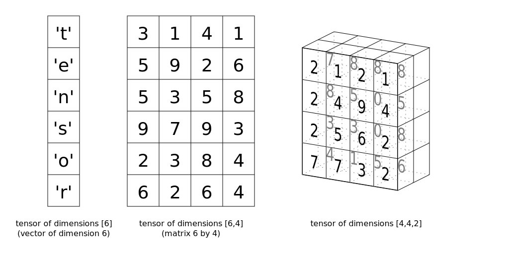

# 深度学习工具 PyTorch 简介

在此 notebook 中，你将了解 [PyTorch](http://pytorch.org/)，一款用于构建和训练神经网络的框架。PyTorch 在很多方面都和 Numpy 数组很像。毕竟，这些 Numpy 数组也是张量。PyTorch 会将这些张量当做输入并使我们能够轻松地将张量移到 GPU 中，以便在训练神经网络时加快处理速度。它还提供了一个自动计算梯度的模块（用于反向传播），以及另一个专门用于构建神经网络的模块。总之，与 TensorFlow 和其他框架相比，PyTorch 与 Python 和 Numpy/Scipy 堆栈更协调。


## 神经网络

深度学习以人工神经网络为基础。人工神经网络大致产生于上世纪 50 年代末。神经网络由多个像神经元一样的单个部分组成，这些部分通常称为单元或直接叫做“神经元”。每个单元都具有一定数量的加权输入。我们对这些加权输入求和，然后将结果传递给激活函数，以获得单元的输出。


数学公式如下所示： 

$$
\begin{align}
y &= f(w_1 x_1 + w_2 x_2 + b) \\
y &= f\left(\sum_i w_i x_i +b \right)
\end{align}
$$

对于向量来说，为两个向量的点积/内积：

$$
h = \begin{bmatrix}
x_1 \, x_2 \cdots  x_n
\end{bmatrix}
\cdot 
\begin{bmatrix}
           w_1 \\
           w_2 \\
           \vdots \\
           w_n
\end{bmatrix}
$$

## 张量

实际上神经网络计算只是对*张量*进行一系列线性代数运算，张量是矩阵的泛化形式。向量是一维张量，矩阵是二维张量，包含 3 个索引的数组是三维张量（例如 RGB 彩色图像）。神经网络的基本数据结构是张量，PyTorch（以及几乎所有其他深度学习框架）都是以张量为基础。



这些是基本知识，我们现在来看 PyTorch 如何构建简单的神经网络。


```python
# First, import PyTorch
import torch
```


```python
def activation(x):
    """ Sigmoid activation function 
    
        Arguments
        ---------
        x: torch.Tensor
    """
    return 1/(1+torch.exp(-x))
```


```python
### Generate some data
torch.manual_seed(7) # Set the random seed so things are predictable

# Features are 3 random normal variables
features = torch.randn((1, 5))
# True weights for our data, random normal variables again
weights = torch.randn_like(features)
# and a true bias term
bias = torch.randn((1, 1))
```


```python
print(features.shape)
print(weights.shape)
```

    torch.Size([1, 5])
    torch.Size([1, 5])


我在上面生成了一些数据，我们可以使用该数据获取这个简单网络的输出。这些暂时只是随机数据，之后我们将使用正常数据。我们来看看：

`features = torch.randn((1, 5))` 创建一个形状为 `(1, 5)` 的张量，其中有 1 行和 5 列，包含根据正态分布（均值为 0，标准偏差为 1）随机分布的值。 

`weights = torch.randn_like(features)` 创建另一个形状和 `features` 一样的张量，同样包含来自正态分布的值。

最后，`bias = torch.randn((1, 1))` 根据正态分布创建一个值。

和 Numpy 数组一样，PyTorch 张量可以相加、相乘、相减。行为都很类似。但是 PyTorch 张量具有一些优势，例如 GPU 加速，稍后我们会讲解。请计算这个简单单层网络的输出。 
> **练习**：计算网络的输出：输入特征为 `features`，权重为 `weights`，偏差为 `bias`。和 Numpy 类似，PyTorch 也有一个对张量求和的 [`torch.sum()`](https://pytorch.org/docs/stable/torch.html#torch.sum) 函数和 `.sum()` 方法。请使用上面定义的函数 `activation` 作为激活函数。


```python
## Calculate the output of this network using the weights and bias tensors
y = activation(torch.sum(features*weights) + bias)
y = activation((features*weights).sum() + bias)
print(y)
```

    tensor([[0.1595]])


你可以在同一运算里使用矩阵乘法进行乘法和加法运算。推荐使用矩阵乘法，因为在 GPU 上使用现代库和高效计算资源使矩阵乘法更高效。

如何对特征和权重进行矩阵乘法运算？我们可以使用 [`torch.mm()`](https://pytorch.org/docs/stable/torch.html#torch.mm) 或 [`torch.matmul()`](https://pytorch.org/docs/stable/torch.html#torch.matmul)，后者更复杂，并支持广播。如果不对`features` 和 `weights` 进行处理，就会报错：


```python
>> torch.mm(features, weights)

---------------------------------------------------------------------------
RuntimeError                              Traceback (most recent call last)
<ipython-input-13-15d592eb5279> in <module>()
----> 1 torch.mm(features, weights)

RuntimeError: size mismatch, m1: [1 x 5], m2: [1 x 5] at /Users/soumith/minicondabuild3/conda-bld/pytorch_1524590658547/work/aten/src/TH/generic/THTensorMath.c:2033
```

在任何框架中构建神经网络时，我们都会频繁遇到这种情况。原因是我们的张量不是进行矩阵乘法的正确形状。注意，对于矩阵乘法，第一个张量里的列数必须等于第二个张量里的行数。`features` 和 `weights` 具有相同的形状，即 `(1, 5)`。意味着我们需要更改 `weights` 的形状，以便进行矩阵乘法运算。

**注意：**要查看张量 `tensor` 的形状，请使用 `tensor.shape`。以后也会经常用到。

现在我们有以下几个选择：[`weights.reshape()`](https://pytorch.org/docs/stable/tensors.html#torch.Tensor.reshape)、[`weights.resize_()`](https://pytorch.org/docs/stable/tensors.html#torch.Tensor.resize_) 和 [`weights.view()`](https://pytorch.org/docs/stable/tensors.html#torch.Tensor.view)。

* `weights.reshape(a, b)` 有时候将返回一个新的张量，数据和 `weights` 的一样，大小为 `(a, b)`；有时候返回克隆版，将数据复制到内存的另一个部分。
* `weights.resize_(a, b)` 返回形状不同的相同张量。但是，如果新形状的元素数量比原始张量的少，则会从张量里删除某些元素（但是不会从内存中删除）。如果新形状的元素比原始张量的多，则新元素在内存里未初始化。注意，方法末尾的下划线表示这个方法是**原地**运算。要详细了解如何在 PyTorch 中进行原地运算，请参阅[此论坛话题](https://discuss.pytorch.org/t/what-is-in-place-operation/16244)。
* `weights.view(a, b)` 将返回一个张量，数据和 `weights` 的一样，大小为 `(a, b)`。

我通常使用 `.view()`，但这三个方法对此示例来说都可行。现在，我们可以通过 `weights.view(5, 1)` 变形 `weights`，使其具有 5 行和 1 列。

> **练习**：请使用矩阵乘法计算网络的输出


```python
## Calculate the output of this network using matrix multiplication
y = activation(torch.mm(features,weights.view(5,1)) + bias)
print(y)
```

    tensor([[0.1595]])


### 堆叠

这就是计算单个神经元的输出的方式。当你将单个单元堆叠为层，并将层堆叠为神经元网络后，你就会发现这个算法的强大之处。一个神经元层的输出变成下一层的输入。对于多个输入单元和输出单元，我们现在需要将权重表示为矩阵。


底部显示的第一个层级是输入，称为**输入层**。中间层称为**隐藏层**，最后一层（右侧）是**输出层**。我们可以再次使用矩阵从数学角度来描述这个网络，然后使用矩阵乘法将每个单元线性组合到一起。例如，可以这样计算隐藏层（$h_1$ 和 $h_2$）： 

$$
\vec{h} = [h_1 \, h_2] = 
\begin{bmatrix}
x_1 \, x_2 \cdots \, x_n
\end{bmatrix}
\cdot 
\begin{bmatrix}
           w_{11} & w_{12} \\
           w_{21} &w_{22} \\
           \vdots &\vdots \\
           w_{n1} &w_{n2}
\end{bmatrix}
$$

我们可以将隐藏层当做输出单元的输入，从而得出这个小网络的输出，简单表示为：

$$
y =  f_2 \! \left(\, f_1 \! \left(\vec{x} \, \mathbf{W_1}\right) \mathbf{W_2} \right)
$$


```python
### Generate some data
torch.manual_seed(7) # Set the random seed so things are predictable

# Features are 3 random normal variables
features = torch.randn((1, 3))
print(features.shape)

# Define the size of each layer in our network
n_input = features.shape[1]     # Number of input units, must match number of input features
n_hidden = 2                    # Number of hidden units 
n_output = 1                    # Number of output units

# Weights for inputs to hidden layer
W1 = torch.randn(n_input, n_hidden)
# Weights for hidden layer to output layer
W2 = torch.randn(n_hidden, n_output)
print(W1.shape)

# and bias terms for hidden and output layers
B1 = torch.randn((1, n_hidden))
B2 = torch.randn((1, n_output))

print(B1.shape)
```

    torch.Size([1, 3])
    torch.Size([3, 2])
    torch.Size([1, 2])


> **练习：**使用权重 `W1` 和 `W2` 以及偏差 `B1` 和 `B2` 计算此多层网络的输出。


```python
## Your solution here
h = activation(torch.mm(features,W1) + B1)
output = activation(torch.mm(h,W2) + B2)
print(output)
```

    tensor([[0.3171]])


如果计算正确，输出应该为 `tensor([[ 0.3171]])`。

隐藏层数量是网络的参数，通常称为**超参数**，以便与权重和偏差参数区分开。稍后当我们讨论如何训练网络时会提到，层级越多，网络越能够从数据中学习规律并作出准确的预测。

## Numpy 和 Torch 相互转换

加分题！PyTorch 可以实现 Numpy 数组和 Torch 张量之间的转换。Numpy 数组转换为张量数据，可以用 `torch.from_numpy()`。张量数据转换为 Numpy 数组，可以用 `.numpy()` 。


```python
import numpy as np
a = np.random.rand(4,3)
a
```


    array([[0.85679551, 0.93626926, 0.284956  ],
           [0.18478529, 0.05775879, 0.44416887],
           [0.68360642, 0.51638607, 0.49711792],
           [0.18593368, 0.53402654, 0.23731168]])


```python
b = torch.from_numpy(a)
b
```


    tensor([[0.8568, 0.9363, 0.2850],
            [0.1848, 0.0578, 0.4442],
            [0.6836, 0.5164, 0.4971],
            [0.1859, 0.5340, 0.2373]], dtype=torch.float64)


```python
b.numpy()
```


    array([[0.85679551, 0.93626926, 0.284956  ],
           [0.18478529, 0.05775879, 0.44416887],
           [0.68360642, 0.51638607, 0.49711792],
           [0.18593368, 0.53402654, 0.23731168]])


Numpy 数组与 Torch 张量之间共享内存，因此如果你原地更改一个对象的值，另一个对象的值也会更改。


```python
# Multiply PyTorch Tensor by 2, in place
b.mul_(2)
```


    tensor([[1.7136, 1.8725, 0.5699],
            [0.3696, 0.1155, 0.8883],
            [1.3672, 1.0328, 0.9942],
            [0.3719, 1.0681, 0.4746]], dtype=torch.float64)


```python
# Numpy array matches new values from Tensor
a

```


    array([[1.71359101, 1.87253851, 0.569912  ],
           [0.36957058, 0.11551758, 0.88833775],
           [1.36721285, 1.03277214, 0.99423583],
           [0.37186737, 1.06805308, 0.47462336]])


```python

```
