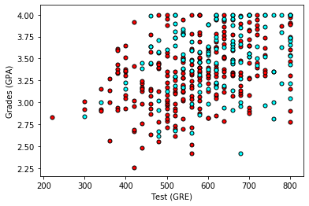
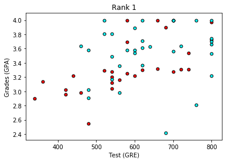
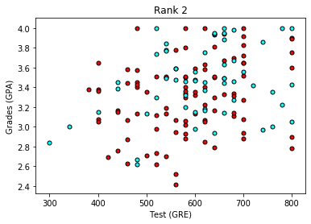
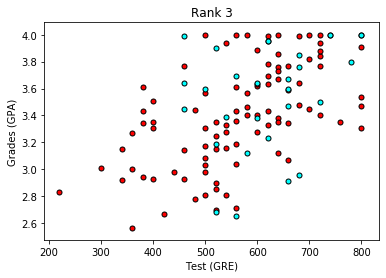
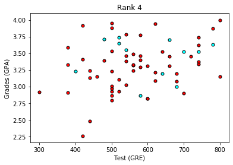

# 利用神经网络来预测学生录取情况

在该 notebook 中，我们基于以下三条数据预测了加州大学洛杉矶分校 (UCLA) 的研究生录取情况：

- GRE 分数（测试）即 GRE Scores (Test)
- GPA 分数（成绩）即 GPA Scores (Grades)
- 评级（1-4）即 Class rank (1-4)

数据集来源： http://www.ats.ucla.edu/

## 加载数据

为了加载数据并很好地进行格式化，我们将使用两个非常有用的包，即 Pandas 和 Numpy。 你可以在这里阅读文档：

- https://pandas.pydata.org/pandas-docs/stable/
- https://docs.scipy.org/


```python
# Importing pandas and numpy
import pandas as pd
import numpy as np

# Reading the csv file into a pandas DataFrame
data = pd.read_csv('student_data.csv')

# Printing out the first 10 rows of our data
data[:10]
```


<div>
<style scoped>
    .dataframe tbody tr th:only-of-type {
        vertical-align: middle;
    }

    .dataframe tbody tr th {
        vertical-align: top;
    }

    .dataframe thead th {
        text-align: right;
    }
</style>
<table border="1" class="dataframe">
  <thead>
    <tr style="text-align: right;">
      <th></th>
      <th>admit</th>
      <th>gre</th>
      <th>gpa</th>
      <th>rank</th>
    </tr>
  </thead>
  <tbody>
    <tr>
      <th>0</th>
      <td>0</td>
      <td>380</td>
      <td>3.61</td>
      <td>3</td>
    </tr>
    <tr>
      <th>1</th>
      <td>1</td>
      <td>660</td>
      <td>3.67</td>
      <td>3</td>
    </tr>
    <tr>
      <th>2</th>
      <td>1</td>
      <td>800</td>
      <td>4.00</td>
      <td>1</td>
    </tr>
    <tr>
      <th>3</th>
      <td>1</td>
      <td>640</td>
      <td>3.19</td>
      <td>4</td>
    </tr>
    <tr>
      <th>4</th>
      <td>0</td>
      <td>520</td>
      <td>2.93</td>
      <td>4</td>
    </tr>
    <tr>
      <th>5</th>
      <td>1</td>
      <td>760</td>
      <td>3.00</td>
      <td>2</td>
    </tr>
    <tr>
      <th>6</th>
      <td>1</td>
      <td>560</td>
      <td>2.98</td>
      <td>1</td>
    </tr>
    <tr>
      <th>7</th>
      <td>0</td>
      <td>400</td>
      <td>3.08</td>
      <td>2</td>
    </tr>
    <tr>
      <th>8</th>
      <td>1</td>
      <td>540</td>
      <td>3.39</td>
      <td>3</td>
    </tr>
    <tr>
      <th>9</th>
      <td>0</td>
      <td>700</td>
      <td>3.92</td>
      <td>2</td>
    </tr>
  </tbody>
</table>
</div>


## 绘制数据


首先让我们对数据进行绘图，看看它是什么样的。为了绘制二维图，让我们先忽略评级 (rank)。


```python
# Importing matplotlib
import matplotlib.pyplot as plt
%matplotlib inline
# Function to help us plot
def plot_points(data):
    X = np.array(data[["gre","gpa"]])
    y = np.array(data["admit"])
    admitted = X[np.argwhere(y==1)]
    rejected = X[np.argwhere(y==0)]
    plt.scatter([s[0][0] for s in rejected], [s[0][1] for s in rejected], s = 25, color = 'red', edgecolor = 'k')
    plt.scatter([s[0][0] for s in admitted], [s[0][1] for s in admitted], s = 25, color = 'cyan', edgecolor = 'k')
    plt.xlabel('Test (GRE)')
    plt.ylabel('Grades (GPA)')
    
# Plotting the points
plot_points(data)
plt.show()
```





粗略来说，它看起来像是，成绩 （grades) 和测试 (test) 分数高的学生通过了，而得分低的学生却没有，但数据并没有如我们所希望的那样，很好地分离。 也许将评级 (rank) 考虑进来会有帮助？ 接下来我们将绘制 4 个图，每个图代表一个级别。


```python
# Separating the ranks
data_rank1 = data[data["rank"]==1]
data_rank2 = data[data["rank"]==2]
data_rank3 = data[data["rank"]==3]
data_rank4 = data[data["rank"]==4]

# Plotting the graphs
plot_points(data_rank1)
plt.title("Rank 1")
plt.show()
plot_points(data_rank2)
plt.title("Rank 2")
plt.show()
plot_points(data_rank3)
plt.title("Rank 3")
plt.show()
plot_points(data_rank4)
plt.title("Rank 4")
plt.show()
```














现在看起来更棒啦，看上去评级越低，录取率越高。 让我们使用评级 (rank) 作为我们的输入之一。 为了做到这一点，我们应该对它进行一次one-hot 编码。

## 将评级进行 One-hot 编码
我们将在 Pandas 中使用 `get_dummies` 函数。


```python
# Make dummy variables for rank
one_hot_data = pd.concat([data, pd.get_dummies(data['rank'], prefix='rank')], axis=1)
one_hot_data[:10]
```


<div>
<style scoped>
    .dataframe tbody tr th:only-of-type {
        vertical-align: middle;
    }

    .dataframe tbody tr th {
        vertical-align: top;
    }

    .dataframe thead th {
        text-align: right;
    }
</style>
<table border="1" class="dataframe">
  <thead>
    <tr style="text-align: right;">
      <th></th>
      <th>admit</th>
      <th>gre</th>
      <th>gpa</th>
      <th>rank</th>
      <th>rank_1</th>
      <th>rank_2</th>
      <th>rank_3</th>
      <th>rank_4</th>
    </tr>
  </thead>
  <tbody>
    <tr>
      <th>0</th>
      <td>0</td>
      <td>380</td>
      <td>3.61</td>
      <td>3</td>
      <td>0</td>
      <td>0</td>
      <td>1</td>
      <td>0</td>
    </tr>
    <tr>
      <th>1</th>
      <td>1</td>
      <td>660</td>
      <td>3.67</td>
      <td>3</td>
      <td>0</td>
      <td>0</td>
      <td>1</td>
      <td>0</td>
    </tr>
    <tr>
      <th>2</th>
      <td>1</td>
      <td>800</td>
      <td>4.00</td>
      <td>1</td>
      <td>1</td>
      <td>0</td>
      <td>0</td>
      <td>0</td>
    </tr>
    <tr>
      <th>3</th>
      <td>1</td>
      <td>640</td>
      <td>3.19</td>
      <td>4</td>
      <td>0</td>
      <td>0</td>
      <td>0</td>
      <td>1</td>
    </tr>
    <tr>
      <th>4</th>
      <td>0</td>
      <td>520</td>
      <td>2.93</td>
      <td>4</td>
      <td>0</td>
      <td>0</td>
      <td>0</td>
      <td>1</td>
    </tr>
    <tr>
      <th>5</th>
      <td>1</td>
      <td>760</td>
      <td>3.00</td>
      <td>2</td>
      <td>0</td>
      <td>1</td>
      <td>0</td>
      <td>0</td>
    </tr>
    <tr>
      <th>6</th>
      <td>1</td>
      <td>560</td>
      <td>2.98</td>
      <td>1</td>
      <td>1</td>
      <td>0</td>
      <td>0</td>
      <td>0</td>
    </tr>
    <tr>
      <th>7</th>
      <td>0</td>
      <td>400</td>
      <td>3.08</td>
      <td>2</td>
      <td>0</td>
      <td>1</td>
      <td>0</td>
      <td>0</td>
    </tr>
    <tr>
      <th>8</th>
      <td>1</td>
      <td>540</td>
      <td>3.39</td>
      <td>3</td>
      <td>0</td>
      <td>0</td>
      <td>1</td>
      <td>0</td>
    </tr>
    <tr>
      <th>9</th>
      <td>0</td>
      <td>700</td>
      <td>3.92</td>
      <td>2</td>
      <td>0</td>
      <td>1</td>
      <td>0</td>
      <td>0</td>
    </tr>
  </tbody>
</table>
</div>


```python
# Drop the previous rank column
one_hot_data = one_hot_data.drop('rank', axis=1)

# Print the first 10 rows of our data
one_hot_data[:10]
```


<div>
<style scoped>
    .dataframe tbody tr th:only-of-type {
        vertical-align: middle;
    }

    .dataframe tbody tr th {
        vertical-align: top;
    }

    .dataframe thead th {
        text-align: right;
    }
</style>
<table border="1" class="dataframe">
  <thead>
    <tr style="text-align: right;">
      <th></th>
      <th>admit</th>
      <th>gre</th>
      <th>gpa</th>
      <th>rank_1</th>
      <th>rank_2</th>
      <th>rank_3</th>
      <th>rank_4</th>
    </tr>
  </thead>
  <tbody>
    <tr>
      <th>0</th>
      <td>0</td>
      <td>380</td>
      <td>3.61</td>
      <td>0</td>
      <td>0</td>
      <td>1</td>
      <td>0</td>
    </tr>
    <tr>
      <th>1</th>
      <td>1</td>
      <td>660</td>
      <td>3.67</td>
      <td>0</td>
      <td>0</td>
      <td>1</td>
      <td>0</td>
    </tr>
    <tr>
      <th>2</th>
      <td>1</td>
      <td>800</td>
      <td>4.00</td>
      <td>1</td>
      <td>0</td>
      <td>0</td>
      <td>0</td>
    </tr>
    <tr>
      <th>3</th>
      <td>1</td>
      <td>640</td>
      <td>3.19</td>
      <td>0</td>
      <td>0</td>
      <td>0</td>
      <td>1</td>
    </tr>
    <tr>
      <th>4</th>
      <td>0</td>
      <td>520</td>
      <td>2.93</td>
      <td>0</td>
      <td>0</td>
      <td>0</td>
      <td>1</td>
    </tr>
    <tr>
      <th>5</th>
      <td>1</td>
      <td>760</td>
      <td>3.00</td>
      <td>0</td>
      <td>1</td>
      <td>0</td>
      <td>0</td>
    </tr>
    <tr>
      <th>6</th>
      <td>1</td>
      <td>560</td>
      <td>2.98</td>
      <td>1</td>
      <td>0</td>
      <td>0</td>
      <td>0</td>
    </tr>
    <tr>
      <th>7</th>
      <td>0</td>
      <td>400</td>
      <td>3.08</td>
      <td>0</td>
      <td>1</td>
      <td>0</td>
      <td>0</td>
    </tr>
    <tr>
      <th>8</th>
      <td>1</td>
      <td>540</td>
      <td>3.39</td>
      <td>0</td>
      <td>0</td>
      <td>1</td>
      <td>0</td>
    </tr>
    <tr>
      <th>9</th>
      <td>0</td>
      <td>700</td>
      <td>3.92</td>
      <td>0</td>
      <td>1</td>
      <td>0</td>
      <td>0</td>
    </tr>
  </tbody>
</table>
</div>


## 缩放数据

下一步是缩放数据。 我们注意到成绩 (grades) 的范围是 1.0-4.0，而测试分数 （test scores) 的范围大概是 200-800，这个范围要大得多。 这意味着我们的数据存在偏差，使得神经网络很难处理。 让我们将两个特征放在 0-1 的范围内，将分数除以 4.0，将测试分数除以 800。


```python
# Making a copy of our data
processed_data = one_hot_data[:]

# TODO: Scale the columns
processed_data['gre'] = processed_data['gre']/800

processed_data['gpa'] = processed_data['gpa']/800

# Printing the first 10 rows of our procesed data
processed_data[:10]
```


<div>
<style scoped>
    .dataframe tbody tr th:only-of-type {
        vertical-align: middle;
    }

    .dataframe tbody tr th {
        vertical-align: top;
    }

    .dataframe thead th {
        text-align: right;
    }
</style>
<table border="1" class="dataframe">
  <thead>
    <tr style="text-align: right;">
      <th></th>
      <th>admit</th>
      <th>gre</th>
      <th>gpa</th>
      <th>rank_1</th>
      <th>rank_2</th>
      <th>rank_3</th>
      <th>rank_4</th>
    </tr>
  </thead>
  <tbody>
    <tr>
      <th>0</th>
      <td>0</td>
      <td>0.475</td>
      <td>0.004513</td>
      <td>0</td>
      <td>0</td>
      <td>1</td>
      <td>0</td>
    </tr>
    <tr>
      <th>1</th>
      <td>1</td>
      <td>0.825</td>
      <td>0.004587</td>
      <td>0</td>
      <td>0</td>
      <td>1</td>
      <td>0</td>
    </tr>
    <tr>
      <th>2</th>
      <td>1</td>
      <td>1.000</td>
      <td>0.005000</td>
      <td>1</td>
      <td>0</td>
      <td>0</td>
      <td>0</td>
    </tr>
    <tr>
      <th>3</th>
      <td>1</td>
      <td>0.800</td>
      <td>0.003987</td>
      <td>0</td>
      <td>0</td>
      <td>0</td>
      <td>1</td>
    </tr>
    <tr>
      <th>4</th>
      <td>0</td>
      <td>0.650</td>
      <td>0.003663</td>
      <td>0</td>
      <td>0</td>
      <td>0</td>
      <td>1</td>
    </tr>
    <tr>
      <th>5</th>
      <td>1</td>
      <td>0.950</td>
      <td>0.003750</td>
      <td>0</td>
      <td>1</td>
      <td>0</td>
      <td>0</td>
    </tr>
    <tr>
      <th>6</th>
      <td>1</td>
      <td>0.700</td>
      <td>0.003725</td>
      <td>1</td>
      <td>0</td>
      <td>0</td>
      <td>0</td>
    </tr>
    <tr>
      <th>7</th>
      <td>0</td>
      <td>0.500</td>
      <td>0.003850</td>
      <td>0</td>
      <td>1</td>
      <td>0</td>
      <td>0</td>
    </tr>
    <tr>
      <th>8</th>
      <td>1</td>
      <td>0.675</td>
      <td>0.004237</td>
      <td>0</td>
      <td>0</td>
      <td>1</td>
      <td>0</td>
    </tr>
    <tr>
      <th>9</th>
      <td>0</td>
      <td>0.875</td>
      <td>0.004900</td>
      <td>0</td>
      <td>1</td>
      <td>0</td>
      <td>0</td>
    </tr>
  </tbody>
</table>
</div>


## 将数据分成训练集和测试集

为了测试我们的算法，我们将数据分为训练集和测试集。 测试集的大小将占总数据的 10％。


```python
sample = np.random.choice(processed_data.index, size=int(len(processed_data)*0.9), replace=False)
train_data, test_data = processed_data.iloc[sample], processed_data.drop(sample)

print("Number of training samples is", len(train_data))
print("Number of testing samples is", len(test_data))
print(train_data[:10])
print(test_data[:10])
```

    Number of training samples is 360
    Number of testing samples is 40
         admit    gre       gpa  rank_1  rank_2  rank_3  rank_4
    7        0  0.500  0.003850       0       1       0       0
    9        0  0.875  0.004900       0       1       0       0
    165      0  0.875  0.005000       1       0       0       0
    158      0  0.825  0.004363       0       1       0       0
    211      0  0.725  0.003775       0       1       0       0
    327      1  0.700  0.004350       0       1       0       0
    132      0  0.725  0.004250       0       1       0       0
    151      0  0.500  0.004225       0       1       0       0
    78       0  0.675  0.003900       1       0       0       0
    350      1  0.975  0.005000       0       1       0       0
        admit    gre       gpa  rank_1  rank_2  rank_3  rank_4
    13      0  0.875  0.003850       0       1       0       0
    15      0  0.600  0.004300       0       0       1       0
    18      0  1.000  0.004687       0       1       0       0
    21      1  0.825  0.004537       0       1       0       0
    30      0  0.675  0.004725       0       0       0       1
    54      0  0.825  0.004175       0       0       1       0
    55      1  0.925  0.005000       0       0       1       0
    56      0  0.700  0.003987       0       0       1       0
    66      0  0.925  0.004525       0       0       0       1
    69      0  1.000  0.004662       1       0       0       0


## 将数据分成特征和目标（标签）
现在，在培训前的最后一步，我们将把数据分为特征 (features)（X）和目标 (targets)（y）。


```python
features = train_data.drop('admit', axis=1)
targets = train_data['admit']
features_test = test_data.drop('admit', axis=1)
targets_test = test_data['admit']

print(features[:10])
print(targets[:10])
```

           gre       gpa  rank_1  rank_2  rank_3  rank_4
    7    0.500  0.003850       0       1       0       0
    9    0.875  0.004900       0       1       0       0
    165  0.875  0.005000       1       0       0       0
    158  0.825  0.004363       0       1       0       0
    211  0.725  0.003775       0       1       0       0
    327  0.700  0.004350       0       1       0       0
    132  0.725  0.004250       0       1       0       0
    151  0.500  0.004225       0       1       0       0
    78   0.675  0.003900       1       0       0       0
    350  0.975  0.005000       0       1       0       0
    7      0
    9      0
    165    0
    158    0
    211    0
    327    1
    132    0
    151    0
    78     0
    350    1
    Name: admit, dtype: int64


## 训练二层神经网络
下列函数会训练二层神经网络。 首先，我们将写一些 helper 函数。


```python
# Activation (sigmoid) function
def sigmoid(x):
    return 1 / (1 + np.exp(-x))
def sigmoid_prime(x):
    return sigmoid(x) * (1-sigmoid(x))
def error_formula(y, output):
    return - y*np.log(output) - (1 - y) * np.log(1-output)
```

# 误差反向传播

现在轮到你来练习，编写误差项。 记住这是由方程 $$ (y-\hat{y})  $$ 给出的。


```python
# TODO: Write the error term formula
def error_term_formula(y, output):
    return (y-output)
```


```python
# Neural Network hyperparameters
epochs = 1000
learnrate = 0.5

# Training function
def train_nn(features, targets, epochs, learnrate):
    
    # Use to same seed to make debugging easier
    np.random.seed(42)

    n_records, n_features = features.shape
    last_loss = None

    # Initialize weights
    weights = np.random.normal(scale=1 / n_features**.5, size=n_features)
    print(weights.shape)
    
    

    for e in range(epochs):
        del_w = np.zeros(weights.shape)
        for x, y in zip(features.values, targets):
            # Loop through all records, x is the input, y is the target

            # Activation of the output unit
            #   Notice we multiply the inputs and the weights here 
            #   rather than storing h as a separate variable 
            output = sigmoid(np.dot(x, weights))

            # The error, the target minus the network output
            error = error_formula(y, output)

            # The error term
            #   Notice we calulate f'(h) here instead of defining a separate
            #   sigmoid_prime function. This just makes it faster because we
            #   can re-use the result of the sigmoid function stored in
            #   the output variable
            error_term = error_term_formula(y, output)
            #print("error_term:",error_term)

            # The gradient descent step, the error times the gradient times the inputs
            del_w += error_term * x

        # Update the weights here. The learning rate times the 
        # change in weights, divided by the number of records to average
        weights += learnrate * del_w / n_records

        # Printing out the error on the training set
        if e % (epochs / 10) == 0:
            out = sigmoid(np.dot(features, weights))
            #print(out)
            loss = np.mean((out - targets) ** 2)
            print("Epoch:", e)
            if last_loss and last_loss < loss:
                print("Train loss: ", loss, "  WARNING - Loss Increasing")
            else:
                print("Train loss: ", loss)
            last_loss = loss
            print("=========")
    print("Finished training!")
    return weights
    
weights = train_nn(features, targets, epochs, learnrate)
```

    (6,)
    Epoch: 0
    Train loss:  0.273075830588848
    =========
    Epoch: 100
    Train loss:  0.20520354225199638
    =========
    Epoch: 200
    Train loss:  0.20393525728827555
    =========
    Epoch: 300
    Train loss:  0.2030136874864369
    =========
    Epoch: 400
    Train loss:  0.2022100443775751
    =========
    Epoch: 500
    Train loss:  0.2015047057211576
    =========
    Epoch: 600
    Train loss:  0.20088633117322183
    =========
    Epoch: 700
    Train loss:  0.2003443983488469
    =========
    Epoch: 800
    Train loss:  0.1998693847500299
    =========
    Epoch: 900
    Train loss:  0.19945286989297628
    =========
    Finished training!


## 计算测试 (Test) 数据的精确度


```python
# Calculate accuracy on test data
tes_out = sigmoid(np.dot(features_test, weights))
predictions = tes_out > 0.5
accuracy = np.mean(predictions == targets_test)
print("Prediction accuracy: {:.3f}".format(accuracy))
```

    Prediction accuracy: 0.675


```python

```
